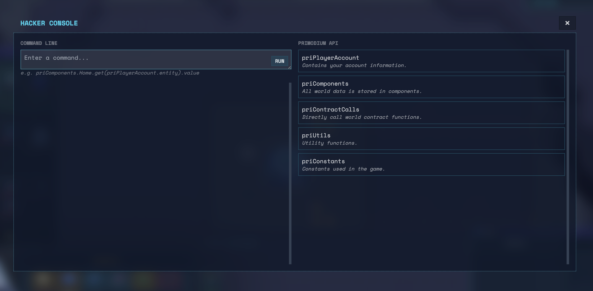
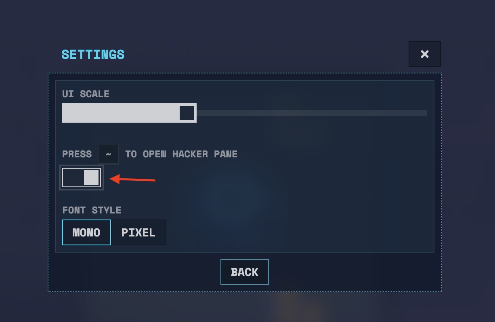

# Hacker Console

The hacker console is a tool that enables players to interact directly with the client game's data and functionality.

## How to access

To access the hacker console, go to general settings and toggle the switch that reads `PRESS ~ TO OPEN HACKER PANE`. Now when you press `~` the hacker console opens. Press `~` again to close it.

## Reading Data

There are a few ways to read data from the game.

### Player Account

Use the player account to see your wallet address, delegate address and private key, and world address. It also includes information about the wagmi client.

### Components

Components store game data. Use them to grab pertinent information quickly.

- **get**: Retrieve a value by providing an entity, which is a hex string.
- **getWithKeys**: Fetch a component using raw keys that match the component's schema.
- **getAll**: Obtain all values of a specific component.
- **getAllWith**: Retrieve all entities of a component that have a specified value.
- **getAllWithout**: Fetch all entities of a component that do not have a specified value.
- **has**: Check if an entity has a specific component.
- **hasWithKeys**: Verify if an entity has a component with given keys.

### Utilities

There are a range of utilties that make it easy to fetch complex data from components. Some potentially helpful utilities include:

- **getFullResourceCount(spaceRockEntity, resource)** - Get the current resource count of some resource on an asteroid
- **getUnitStats(unitEntity, spaceRockEntity)** - See relevant stats about a unit
- **getBuildingInfo(buildingEntity)** - Get a range of data about a building entity
- **getUpgradeInfo(unitPrototype, asteroid)** - See information about the next level of upgrade for an entity

Use these utilities and the others in the hacker pane to craft advanced strategies and have the edge on the opposition.

## Calling Contract Systems

The console allows direct interaction with contract functions, enabling advanced game mechanics and world interactions:

## Accessing Utilities

Utility functions provide helpful shortcuts and tools for common tasks and calculations within the game:

- **priUtils**: A collection of utility functions to simplify common tasks.
- **calcDims**: Calculate the dimensions of a building, useful for planning and optimization.
- **relCoordToAbs**: Convert relative coordinates to absolute, aiding in navigation and positioning.
- **entityToColor**, **entityToPlayerName**, **entityToRockName**: Convert game entities to various representations like color or names for easier identification.

### Constants

Use constants and enums to convert the names of elements into indicies and entities. Constants include

- **SCALE** Use scale to convert the raw value of a resource into a human readable value
- **EntityType** Use entity type to convert the name of an entity into its raw entity value used throughout the smart contracts.
- **EnumLookup/EntityLookup** Use lookups to convert between raw entity IDs and their corresponding enumerated values, used primary with resources in smart contracts.

Each of these functions can be accessed through the hacker console, providing players with a versatile toolset for exploring and interacting with the game's underlying systems.

# GOOD LUCK!
