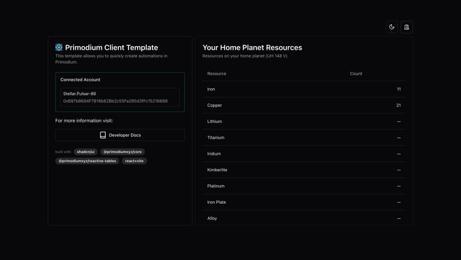

# Primodium Client Templates

[**Primodium Client Templates**](https://github.com/primodiumxyz/create-primodium)
provide scaffolding for custom Primodium clients built with the
[Primodium Core](./client-core.mdx) TypeScript API. Visit the demo site
[here](https://template-react-client-primodium.vercel.app/).



## Getting Started

> **Compatibility Note:** Primodium requires [Node.js](https://nodejs.org/en/)
> version 18+, 20+. However, some templates require a higher Node.js version to
> work. Please upgrade if your package manager warns about it.

With `npm`:

```bash copy
npm create primodium@latest
```

With `yarn`:

```bash copy
yarn create primodium
```

With `pnpm`:

```bash copy
pnpm create primodium
```

With `bun`:

```bash copy
bun create primodium
```

Then follow the prompts!

You can also directly specify the project name and the template you want to use
via additional command line options:

```bash copy
# npm 7+, extra double-dash is needed:
npm create primodium@latest my-primodium-app --template react-client

# yarn
yarn create primodium my-primodium-app --template react-client

# pnpm
pnpm create primodium my-primodium-app --template react-client

# Bun
bun create primodium my-primodium-app --template react-client
```

Currently supported template presets include:

- `react-client`: for building custom clients with the
  [Primodium Core Library](./client-core.mdx)
- `react-client-lite`: for building read-only dashboards with the
  [Primodium GraphQL Endpoint](./graphql.mdx)

You can use `.` for the project name to scaffold in the current directory.

## Production ESLint Config

If you are developing a production application, we recommend updating the
default `eslintrc.cjs` config to enable type aware lint rules:

- Add the following `parserOptions` property to the the top-level configuration:

```js filename=".eslintrc.cjs" showLineNumbers {3-8} copy
module.exports = {
  // ...other rules
  parserOptions: {
    ecmaVersion: "latest",
    sourceType: "module",
    project: ["./tsconfig.json", "./tsconfig.node.json"],
    tsconfigRootDir: __dirname,
  },
};
```

- Replace `plugin:@typescript-eslint/recommended` with
  `plugin:@typescript-eslint/recommended-type-checked` or
  `plugin:@typescript-eslint/strict-type-checked`.
- Optionally, add `plugin:@typescript-eslint/stylistic-type-checked`.
- Install
  [eslint-plugin-react](https://github.com/jsx-eslint/eslint-plugin-react) and
  add `plugin:react/recommended` & `plugin:react/jsx-runtime` to the `extends`
  list.

The final `.eslintrc.cjs` will look like this:

```js filename=".eslintrc.cjs" showLineNumbers {6-7,9-10,16-22} copy
module.exports = {
  root: true,
  env: { browser: true, es2020: true },
  extends: [
    "eslint:recommended",
    "plugin:@typescript-eslint/recommended-type-checked", // or plugin:@typescript-eslint/strict-type-checked
    "plugin:@typescript-eslint/stylistic-type-checked", // optional
    "plugin:react-hooks/recommended",
    "plugin:react/recommended",
    "plugin:react/jsx-runtime",
  ],
  ignorePatterns: ["dist", ".eslintrc.cjs"],
  parser: "@typescript-eslint/parser",
  plugins: ["react-refresh"],

  // Add parserOptions
  parserOptions: {
    ecmaVersion: "latest",
    sourceType: "module",
    project: ["./tsconfig.json", "./tsconfig.node.json"],
    tsconfigRootDir: __dirname,
  },
};
```
