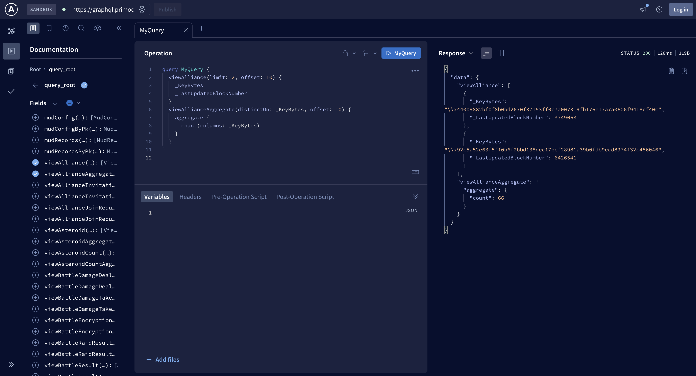

# Creating Dashboards

As a fully on-chain game, Primodium supports a wide range of data that can be
queried and displayed in dashboards. This guide will show you how to query
decoded and encoded data from the Primodium blockchain using our GraphQL
endpoint.

## GraphQL Endpoint

This section assumes knowledge of [GraphQL](https://graphql.org/) and its
related technologies.

Primodium provides a GraphQL endpoint for querying decoded on-chain data, which
can be used to create dashboards. The endpoint is a [Hasura](https://hasura.io/)
instance that provides a GraphQL API over our internal
[Primodium indexer](../pages/indexer.mdx) database.

```bash copy
https://graphql.primodium.ai/v1/graphql
```

We recommend using a GraphQL playground to introspect our schema, such as the
following:

- [Apollo Studio](https://studio.apollographql.com/sandbox/explorer)
- [GraphiQL Online](https://lucasconstantino.github.io/graphiql-online/)

Refer to the
[Hasura docs](https://hasura.io/docs/latest/queries/postgres/index/) for more
information on advanced querying.

## Quickstart

> NOTE: Currently, tables and its fields are exposed; however, full data type
> support and relations are missing due to the nature of how are decoded data is
> stored.

For this guide, we will use _Apollo Studio_ to read Primodium data from our
GraphQL endpoint.

1. Visit [Apollo Studio](https://studio.apollographql.com/sandbox/explorer).
2. Set the sandbox url to our endpoint on the top-left field:
   `https://graphql.primodium.ai/v1/graphql`



3. Query away with the following examples:

### Query Decoded Data

This example queries the top 10 scores of the current round:

```gql showLineNumbers copy
query Top10Score {
  viewScore(limit: 10, orderBy: { value: DESC }) {
    entity
    value
  }
}
```

### Query Encoded Data

This example queries MUD records between a block range:

```gql showLineNumbers copy
query MudRecords(
  $where: MudRecordsBoolExp = { blockNumber: { _lte: 4824475, _gte: 4823475 } }
  $limit: Int = 1000
) {
  mudRecords(where: $where, limit: $limit) {
    address
    blockNumber
    dynamicData
    encodedLengths
    isDeleted
    key0
    key1
    keyBytes
    logIndex
    staticData
    tableId
  }
}
```

## React Template

- [react-client-lite](../react-client-lite.mdx): Minimal setup to start creating
  read-only clients with the Primodium GraphQL endpoint.
