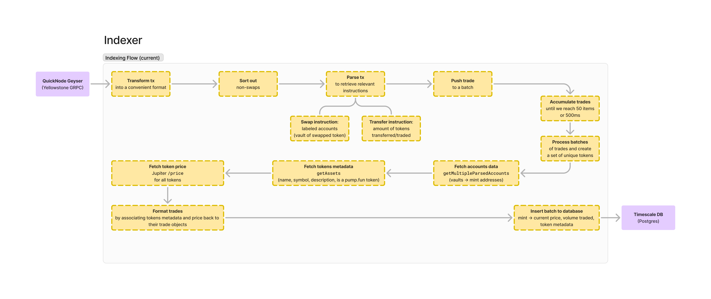

# Solana DEX Indexer

**A TypeScript indexer for DEX trades on Raydium (Solana) using Yellowstone
GRPC.**

It is best used in conjunction with the [`dex-graphql`](./graphql.mdx) package,
which provides a GraphQL API for querying the data, and the complete infra for
setting up a Timescale database optimized for time-series data, and interacting
with it through Hasura.

_DEX Indexer is available from npm as
[`@primodiumxyz/dex-indexer`](https://www.npmjs.com/package/@primodiumxyz/dex-indexer)._

## Introduction

The source code this repository is available on Github
[here](https://github.com/primodiumxyz/dex-indexer-stack/tree/main/packages/indexer).

### Overview

This package is used to index filtered transactions streamed from a Yellowstone
GRPC server—i.e. swaps made on the Raydium AMM program—into a postgres database,
with relevant data being parsed and/or fetched from external sources. The
resulting trades and associated tokens are then available for querying through
the
[dex-graphql](https://github.com/primodiumxyz/dex-indexer-stack/tree/main/packages/gql)
package.

The indexer is designed to be run in a Docker container, but it can also be run
directly in a node environment.

There are a few dependencies on external services:

- [Jupiter](https://station.jup.ag/docs/apis/price-api-v2) for fetching token
  prices (`/prices`)
- [DAS API](https://developers.metaplex.com/das-api) for fetching token metadata
  in the Metaplex standard (`/getAssets`)
- [Yellowstone GRPC](https://github.com/rpcpool/yellowstone-grpc) for streaming
  transactions with low latency

All of these are available from QuickNode through add-ons, which is the
recommended way to run the indexer.

This also requires careful consideration and planning to configure
[batch sizes and batching mode](https://github.com/primodiumxyz/dex-indexer-stack/blob/main/packages/indexer/bin/parseEnv.ts),
due to possible rate limits.

On the database side, the preferred way is to use Timescale, which is optimized
for time-series data, meaning that insertions performance won't be an issue.
Additionally, the
[dex-graphql](https://github.com/primodiumxyz/dex-indexer-stack/tree/main/packages/gql)
package provides functionality that is focused on leveraging Timescale's
capabilities for super-fast queries and subscriptions.

Otherwise, the indexer just needs a postgres interface that will support
inserting many trade entries in the following format (see
[insertTrades](https://github.com/primodiumxyz/dex-indexer-stack/blob/main/packages/indexer/src/lib/utils.ts)):

```typescript
// As a TypeScript type for better readability
type Trade = {
  token_mint: string;
  volume_usd: string;
  token_price_usd: string;
  created_at: Date;
  token_metadata: string;
};

// `token_metadata` being a composite type:
type TokenMetadata = {
  name: string;
  symbol: string;
  description: string;
  image_uri: string;
  external_url: string;
  decimals: string;
  supply: number;
  is_pump_token: boolean;
};
```

### Installation

Just install the package from npm, preferably with pnpm.

```bash
pnpm add @primodiumxyz/dex-indexer
```

### Quickstart

1. Configuration

Add the following environment variables to your `.env` file:

| Variable              | Description             | Default                 |
| --------------------- | ----------------------- | ----------------------- |
| `NODE_ENV`            | Node environment        | `local`                 |
| `HASURA_URL`          | Hasura URL              | `http://localhost:8090` |
| `HASURA_ADMIN_SECRET` | Hasura admin secret     |                         |
| `QUICKNODE_ENDPOINT`  | Quicknode endpoint      |                         |
| `QUICKNODE_TOKEN`     | Quicknode token         |                         |
| `JUPITER_URL`         | Jupiter API URL         |                         |
| `PROCESSING_MODE`     | Processing mode         | `parallel`              |
| `MAX_BATCH_SIZE`      | Maximum batch size      | `100`                   |
| `MIN_BATCH_FREQUENCY` | Minimum batch frequency | `500`                   |

The variables with no default value are required.

2. Run

```sh
local-dex-indexer
# or specify the path to your .env file (install @dotenvx/dotenvx first)
dotenvx run -f ./path/to/.env --quiet -- local-dex-indexer
```

## Usage

### Docker

Usage with Docker is the recommended way to run the indexer, as you can directly
consume
[the image published on the GitHub Container Registry](https://github.com/primodiumxyz/dex-indexer-stack/pkgs/container/sdi-indexer).

You can use the
[`indexer.docker-compose.yaml`](https://github.com/primodiumxyz/dex-indexer-stack/blob/main/resources/indexer.docker-compose.yaml)
file linked in the resources, fill in the environment variables, and run:

```sh
docker compose up
```

This will pull the image from the registry and start the indexer.

To stop the indexer, you can use:

```sh
docker compose down --remove-orphans
```

### TypeScript

Usage with TypeScript is pretty straightforward as well, although it is not the
way it was designed for.

Just import the `start` function from the package and call it:

```typescript
import { start } from "@primodiumxyz/dex-indexer";

const run = async () => {
  await start();
};

run();
```

Don't forget to run it with the environment variables context.

### Development

If you would like to develop on the indexer, you can do so by following these
steps:

1. Clone the repository:

   ```sh
   git clone https://github.com/primodiumxyz/dex-indexer-stack.git
   ```

2. Install the dependencies:

   ```sh
   pnpm i
   ```

3. Run

   a. everything (indexer & database) from root dir with:

   ```sh
   pnpm dev
   ```

   b. only the indexer if the database is already running:

   ```sh
   cd packages/indexer
   pnpm start
   ```

You can also build the package for production at any point:

    ```sh
    cd packages/indexer
    pnpm build
    ```

## Details

### Indexing flow

 _Diagram of the
indexing flow_

### Structure

```ml
dist - "Compiled files for distribution"
src - "Source files"
├── bin - "Entry point of the package (running the indexer & validating the environment)"
├── lib - "All of the internal logic, constants & types"
│   └── parsers - "Parsing logic with the global Solana parser, any parser specific to a DEX and utilities"
└── index.ts - "Main module, exports the `start` function to run the indexer"
```

### References

- [A list of discriminators and accounts for major Solana DEXes](https://github.com/Topledger/solana-programs/tree/main/dex-trades/src/dapps)

## Contributing

If you wish to contribute to the package, please open an issue first to make
sure that this is within the scope of the library, and that it is not already
being worked on.

## License

This project is licensed under the MIT License - see
[LICENSE](https://github.com/primodiumxyz/dex-indexer-stack/blob/main/LICENSE)
for details.

The library contains a few chunks of code copied and
[modified from Shyft](https://github.com/Shyft-to/solana-tx-parser-public),
especially in `lib/parsers`, mainly for fixing formatting inconsistencies or
missing types, and easier integration with the rest of the codebase. It is as
best as possible documented above each block of code inside the JSDoc comments.
