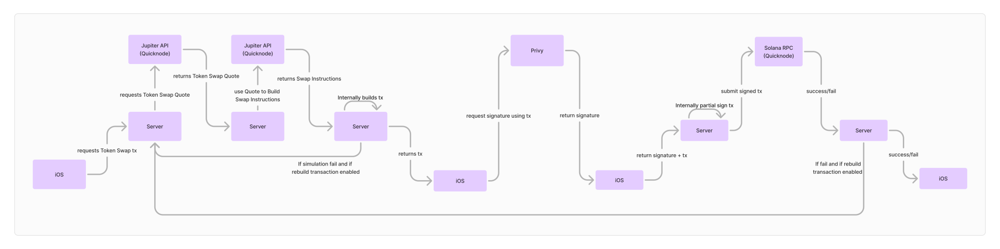

# Solana DEX Server



The **Primodium DEX Server** is a TypeScript-based tRPC server for Solana,
providing protected API endpoints for building and sponsoring user transactions.

This package is available as a npm package at
[`@primodiumxyz/dex-server`](https://www.npmjs.com/package/@primodiumxyz/dex-server),
and the Docker image is available at
[`ghcr.io/primodiumxyz/dex-server`](https://github.com/primodiumxyz/dex-server/pkgs/container/dex-server).
The source code for this repository is available on Github
[here](https://github.com/primodiumxyz/dex-server).

## Description

The Server offers a set of tRPC endpoints for various operations centered around
building user transactions and sponsoring the SOL required for chain execution
fees. It uses Fastify as the underlying web server.

The server provides comprehensive token trading functionality including
real-time price tracking, automated fee calculations, and transaction
sponsorship. It features WebSocket-based streaming for live price updates and
iOS push notifications for price tracking. The system is built with
configurability in mind, using Redis for live configuration updates and
supporting automated background tasks for maintenance operations.

For price tracking to be enabled, the `HASURA_URL` and `HASURA_ADMIN_SECRET`
environment variables must be set, and point to a running instance of the
[DEX GraphQL package](https://github.com/primodiumxyz/dex-indexer-stack/tree/main/packages/gql).
If you would like to use this feature,
[you will need to run the DEX Indexer stack](https://github.com/primodiumxyz/dex-indexer-stack/).

## Features

- Transaction building and sponsorship
- Fee calculation and management system
- Solana wallet integration and balance tracking
- JWT-based authentication
- tRPC-based API for type-safe client-server communication
- WebSocket support for real-time updates
- Redis-based configuration management with live updates
- Automated background tasks via CronService
- Real-time token price tracking
- Apple Push Notification Service (APNS) integration for iOS live activities

## Usage

To run the server:

```sh
pnpm start
```

### Example client

```ts
const server = createServerClient({
  httpUrl: "http://localhost:8888/trpc",
  wsUrl: "ws://localhost:8888/trpc",
  httpHeaders: () => {
    const jwtToken = useUserStore.getState().jwtToken;
    return {
      Authorization: `Bearer ${jwtToken}`,
    };
  },
});

const results = await server.registerNewUser.mutate({
  username: "test",
  airdropAmount: "100",
});
```

## Configuration

The server can be configured with the following environment variables:

| Variable                | Description                           | Default     |
| ----------------------- | ------------------------------------- | ----------- |
| `NODE_ENV`              | Environment (local, dev, test, prod)  | `local`     |
| `SERVER_HOST`           | Host that the server listens on       | `0.0.0.0`   |
| `SERVER_PORT`           | Port that the server listens on       | `8888`      |
| `REDIS_HOST`            | Host that the Redis server listens on | `localhost` |
| `REDIS_PORT`            | Port that the Redis server listens on | `6379`      |
| `REDIS_PASSWORD`        | Password for the Redis server         |             |
| `QUICKNODE_ENDPOINT`    | URL of the Quicknode endpoint         |             |
| `QUICKNODE_TOKEN`       | Token for the Quicknode endpoint      |             |
| `JUPITER_URL`           | Endpoint for the Jupiter V6 Swap API  |             |
| `HASURA_URL`            | URL of the Hasura endpoint            |             |
| `HASURA_ADMIN_SECRET`   | Admin secret for the Hasura endpoint  |             |
| `JWT_SECRET`            | Secret for JWT signing                | `secret`    |
| `PRIVY_APP_SECRET`      | Secret for Privy app                  |             |
| `PRIVY_APP_ID`          | ID for Privy app                      |             |
| `FEE_PAYER_PRIVATE_KEY` | Private key for the fee payer         |             |
| `TEST_USER_PRIVATE_KEY` | Private key for the test user         |             |
| `APPLE_PUSH_KEY_ID`     | Key ID for Apple Push Notifications   |             |
| `APPLE_PUSH_TEAM_ID`    | Team ID for Apple Push Notifications  |             |
| `APPLE_AUTHKEY`         | Auth key for Apple Push Notifications |             |

The server can be further configured with the following Redis variables in
`default-redis-config.json`. Ensure that `TRADE_FEE_RECIPIENT` is set to the
address of the account that will receive the trade fees.

## Development

To set up the project for development:

1. Ensure all server-related env variables are set.
2. If Redis is not installed, make sure that `NODE_ENV` is set to `local` in the
   root `.env` file for Redis to be installed in the `prepare` step of
   `pnpm install`. Refer to `prepare` script in
   [`./package.json`](https://github.com/primodiumxyz/dex-server/blob/main/package.json)
   for details.
3. Install dependencies:

   ```bash
   pnpm install
   ```

4. To run this application in a standalone environment with Redis, run the
   following which starts both `redis-server` and the `server` application.

```bash
pnpm dev:standalone
```

5. For testing:

   ```bash
   pnpm test
   ```

## API Endpoints

The server exposes the following tRPC endpoints:

### Query Procedures

1. `getStatus`

   - Description: Returns the current status of the server
   - Response: `{ status: number }`

2. `getSolUsdPrice`

   - Description: Returns the current SOL/USD price
   - Response: `number`

3. `getSolBalance`

   - Description: Gets user's SOL balance
   - Response: `number`

4. `getAllTokenBalances`

   - Description: Gets all token balances for user
   - Response: Array of token balances

5. `getTokenBalance`

   - Description: Gets balance for specific token
   - Input: `{ tokenMint: string }`

6. `fetchSwap`

   - Description: Fetches a constructed swap transaction for the user. This
     transaction will need to be signed by the user, then sent to the server via
     `submitSignedTransaction`.
   - Input:
     `{ buyTokenId: string, sellTokenId: string, sellQuantity: number, slippageBps?: number }`

7. `fetchPresignedSwap`

   - Description: Fetches swap transaction pre-signed by the server's fee payer.
     This transaction will need to be signed by the user but can be submitted to
     any Solana node.
   - Input: `{ buyTokenId: string, sellTokenId: string, sellQuantity: number }`

8. `getEstimatedTransferFee`

   - Description: Gets estimated fee for transferring USDC to a different
     address
   - Response: Fee estimate in USDC base units

9. `fetchTransferTx`
   - Description: Fetches a constructed transfer transaction for the user. This
     transaction will need to be signed by the user, then sent to the server via
     `submitSignedTransaction`.
   - Input: `{ toAddress: string, amount: string, tokenId: string }`

### Subscription Procedures

1. `subscribeSolPrice`

   - Description: Real-time SOL price updates
   - Response: Stream of price updates

2. `swapStream` [deprecated]
   - Description: Real-time swap quote updates. Currently deprecated and unused,
     but could be used in the future for real-time updates.
   - Input:
     `{ request: { buyTokenId: string, sellTokenId: string, sellQuantity: number } }`

### Mutation Procedures

1. `submitSignedTransaction`

   - Description: Submits a signed transaction to the server. This transaction
     will be sponsored by the server's fee payer and submitted to the Solana
     network.
   - Input: `{ signature: string, base64Transaction: string }`

2. `updateSwapRequest` [deprecated]

   - Description: Updates parameters for an existing swap stream's request
   - Input: `{ buyTokenId: string, sellTokenId: string, sellQuantity: number }`

3. `stopSwapStream` [deprecated]

   - Description: Stops an active swap stream
   - Response: void

4. `startLiveActivity`

   - Description: Starts live price tracking for a token
   - Input:
     `{ tokenMint: string, tokenPriceUsd: string, deviceToken: string, pushToken: string }`

5. `stopLiveActivity`
   - Description: Stops live price tracking
   - Response: `{ success: boolean }`

## Testing

Before running tests on the server, first create a `.env.test` file with the
appropriate environment variables. See `example.env.test` for an example.

1. Run the following to start the server:

   ```bash
   pnpm dev:standalone
   ```

2. Then run the following command to start tests:

   ```bash
   pnpm test
   ```

### Testing Transactions Setup

You can test transactions by running the `service.test.ts` file.

1. You may need to manually remove any `.skip` flags from the tests you want to
   run. These are placed there to prevent the tests from being run on every
   commit.
2. Ensure that your `FEE_PAYER` has a few dollars worth of SOL in it to pay for
   the chain fees. If this is not met, the test transactions will fail.
3. Ensure that your `FEE_PAYER` has an existing USDC ATA that has a rent-exempt
   balance (currently 0.002039 SOL). If this is not met, the test transactions
   will fail.
4. Optionally, you can change the token being traded in the tests by editing
   `MEMECOIN_MAINNET_PUBLIC_KEY` in `src/constants/tokens.ts`.
5. Check that the dev server is still running, then run the test file with the
   following command:

   ```bash
   pnpm test service.test.ts
   ```
