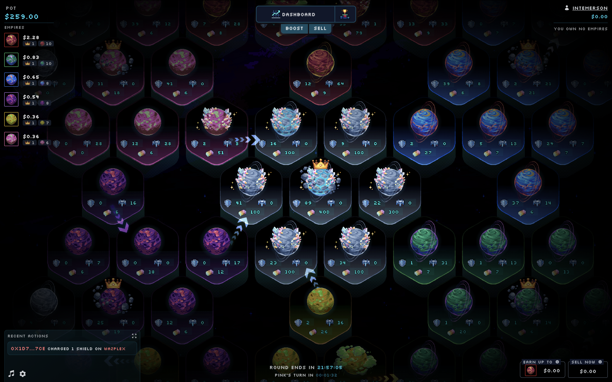
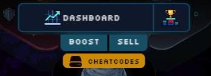

# Primodium: Empires



Primodium: Empires is a fully onchain, turn-based, prediction market game, built
with MUD & Phaser. It was formerly deployed on Base and playable at
[https://empires.primodium.com](https://empires.primodium.com).

## Introduction

The source code Primodium: Empires is available on Github
[here](https://github.com/primodiumxyz/empires) under details listed in the
[License](#license) section of this page. The contracts have been fully audited
by [_Pashov Audit Group_](https://x.com/PashovAuditGrp).

### Overview

In this game, players can compete or collaborate to help an empire win the game,
by capturing the most planets (or the most capital planets) before the round
ends.

Each turn, the game's state is updated and each planet owned by the empire which
turn it is will choose between a few random actions:

- **Move**: Send ships to an adjacent planet.
- **Accumulate**: Accumulate resources (ships, shields, gold).
- **Transform**: Transform accumulated gold into shields or ships.

A planet is captured when there are more ships from another empire incoming than
the planet's current shields and ships combined.

Players can purchase special actions that will both improve the chances of the
impacted empire to win, and give them some shares of this empire in return. The
more shares they have when (if) the empire wins, the more they will receive from
the global pool.

The actions are the following:

- **Add ships**: Add ships to a planet.
- **Add shields**: Add shields to a planet.
- **Place magnet**: Add a magnet from an empire to a planet to increase the
  chances of the nearest planets owned by this empire to send ships to it.
- **Trigger acid rain**: Trigger a rain of acid on a planet to destroy a portion
  of its ships on every turn for a few turns.
- **Explode shield eater**: Tickle the worm, which is traveling between planets,
  to bait it into eating a good portion of the planet's shields and all
  neighboring planets' shields.

And some special global interactions, which are:

- **Boost empire**: Distribute gold to all planets owned by the empire and
  receive some shares in return.
- **Sell shares**: Sell shares of the empire to the market on a bonding curve.

### Installation

#### Prerequisites

There are a few CLI tools to install to be compatible with the entire monorepo.

- [node](https://nodejs.org/en/download/) v20.x - Tested with node v20.18.2.
  - You can use [nvm](https://github.com/nvm-sh/nvm) to install and manage
    multiple versions of node.
- [pnpm](https://pnpm.io/installation) v8.x - Tested with pnpm v8.15.9.
- [Foundry](https://book.getfoundry.sh/getting-started/installation) - This will
  get installer during the "prepare" script.

#### Setup

Clone this repository:

```bash
git clone https://github.com/primodiumxyz/primodium-empires.git
```

Install all dependencies:

```bash
pnpm i
```

### Environment

Create a `.env` file in the root of the project, and follow the instructions in
the `.env.example` file to set the environment variables.

```bash
cp .env.example .env
```

You will also need to write some contracts-specific environment variables in the
contracts and payman packages.

```bash
cp ./packages/contracts/.env.example ./packages/contracts/.env
cp ./packages/payman/.env.example ./packages/payman/.env
```

### Structure

```ml
apps - "Applications that run the game"
├── keeper - "Keeper for updating the world periodically"
└── web - "React client that integrates other components and supercharges with a browser UI"
packages - "Components of the entire stack for running Empires"
├── assets - "All ingame assets and atlas"
├── contracts - "MUD contracts, configuration and infrastructure—basically the whole state and conditions of the game"
├── core - "Core logic, systems, hooks and utilities for the client"
├── engine - "Game engine for managing Phaser scenes and user inputs"
├── game - "Core Phaser infrastructure for the game; objects, scenes, systems, input controls, etc."
└── payman - "Payout manager contract and tests"
```

## Development

### Running the game

The whole stack can be run with the following command:

```bash
pnpm dev
```

This will run a series of scripts each in a separate window, including the
client, the development chain (on which contracts get deployed) and the local
postgres indexer.

After running the command, you can deploy the contracts with the following
command:

```bash
pnpm deploy:local
```

> NOTE: When running the indexer locally, docker network and volumes properly
> clear only on rerun of `pnpm dev:indexer`. If you would like to manually free
> these resources run `pnpm clean:indexer`.

### Building

You can build the entire monorepo with the following command:

```bash
pnpm build
```

This will build the web package and compile the contracts as well as generate
the ABIs and TypeScript bindings.

### Testing

To run the tests for every package, run the following:

```bash
pnpm test
```

Or if you want to run the tests for a specific package, navigate to that package
directory and run the same command.

## Deployment

To deploy the contracts on a specific chain, follow these steps:

1. Update
   [`.env`](https://github.com/primodiumxyz/empires/tree/main/.env.example):
   - `PRI_DEV`: set to `"false"` if you don't want to deploy the `DevSystem`
     contract.
   - `PRI_CHAIN_ID`: set to the chain you want to deploy to; you will also need
     to add or update the `[profile.<chain_id>]` field in
     [`packages/contracts/foundry.toml`](https://github.com/primodiumxyz/empires/tree/main/packages/contracts/foundry.toml).
2. Fill in all the environment variables in
   [`packages/contracts/.env`](https://github.com/primodiumxyz/empires/tree/main/packages/contracts/.env.example)
   and
   [`packages/payman/.env`](https://github.com/primodiumxyz/empires/tree/main/packages/payman/.env.example).
3. Deploy the contracts:
   ```bash
   pnpm deploy:<chain_id> # if the command doesn't exist, create it in both `packages/contracts/package.json` and `package.json`
   ```

## Usage

### Game states

There are a few different game states to be aware of:

1. `Ready`: The game has been successfully deployed and is ready to be started.
   Admins can `pause()` the game via the client cheatcodes, which sets the
   `Ready` table to `false`.
2. `gameStartBlock`: The block at which the game will start. Admins can set this
   via the client cheatcodes, which calls `setGameConfigAndTurn()`. Viewable in
   the `P_GameConfig` table.
3. `WinningEmpire`: The empire that has won the game. Whenever this is set as
   `EEmpire.NULL`, the winner has not been decided yet. Resets to `EEmpire.NULL`
   when `resetGame()` is called. Viewable in the `WinningEmpire` table.
4. `gameOverBlock`: The block at which the game will end due to time running
   out. Admins can set this via the client cheatcodes, which calls
   `setGameConfigAndTurn()`. Viewable in the `P_GameConfig` table.

### First match start

Although the world may be deployed, ready, and the game start block is reached,
the turns will not progress until the Keeper is started. Players could however
still purchase overrides if other conditions above were met and the keeper is
not yet started.

On the web app, click the cheatcodes button:



If you'd like to adjust the game start block, you can do so by clicking on the
`Update game config` cheatcode and changing the appropriate value.

Start the keeper with the following procedure:

1. Set the bearer token so your client can send requests to the keeper endpoint.

- you will find the "set bearer token" cheatcode at the bottom of the cheatcodes
  panel;
- the token will be saved in the browser's local storage.

2. Start the Keeper with the `Start keeper` cheatcode.

### Reset Game

Once the game has finished and you would like to reset it for a new match, you
can do so with the `Reset Game` cheatcode. Make sure to set an appropriate
`gameStartBlock` when calling this cheatcode.

### Cheatcodes

Cheatcodes have different permissions (marked as "dev"/"admin"/"bearer").

- `dev`: only available through `DevSystem`, meaning in non-production
  environments;
- `admin`: only available to accounts with the `ADMIN` role;
- `bearer`: requires a the bearer token to reach endpoints.

## Contributing

If you wish to contribute to the package, please open an issue first to make
sure that this is within the scope of the repository, and that it is not already
being worked on.

## License

This project is licensed under the MIT License - see
[LICENSE](https://github.com/primodiumxyz/empires/tree/main/LICENSE) for
details.

While the codebase is published under the MIT license, all sprites and artwork
remain the intellectual property of Primodium Inc. Commercial use of these
assets is strictly prohibited unless explicit written permission is granted.

Furthermore, at the artist’s request, the sprites and artwork may not be used
for training any machine learning models.
