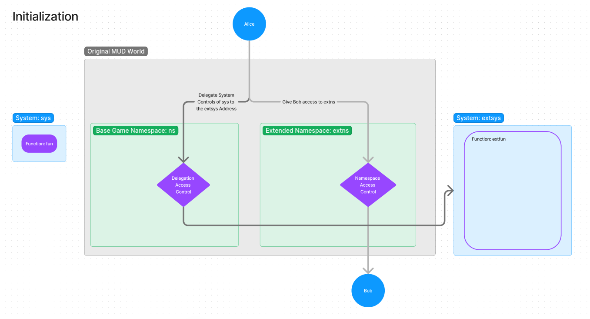

# Primodium Contract Plugin Examples

Source code for the following examples are available [here](https://github.com/primodiumxyz/developers/tree/main/examples/).

## Plugin Examples

The following are example plugins that can be deployed alongside the existing Primodium world contracts.

## Framework for Plugins

- Base world must have a delegation module installed (ex: MUD's existing `StandardDelegationsModule.sol`)
- A plugin with maximum customizability requires new namespaces and systems
- General flow involves delegating control of a base system to a private system in a new namespace, then giving others access to the namespace

### plugin-upgrade-bounty (WIP)

A plugin that creates a bounty to upgrade a building for another player in exchange for a reward.

Building upgrades cost resources, and it takes time to accumulate the necessary resources.
There are some advantages of accelerating resource accumulation when you upgrade a building as soon as possible.
If Alice is going to be AFK and doesn't want to manage running a bot, she can create a building
upgrade bounty and delegate the upgrade to another player, Bob, in exchange for a small reward.

- Alice deploys and registers namespace and private systems for extending game logic
- Alice delegates UpgradeBuildingSystem control to the private system
- Alice deposits escrow (ETH) for the bounty in the private system
- Alice registers namespace access to Bob, Charlie, etc. to enable their participation in the bounty
- Bob calls the private system to upgrade Alice's building
- Bob receives the bounty reward from the private system

### plugin-delegate-orbiting-fleet (backlog)

A plugin that enables a player to delegate control of their orbiting fleet to another player.

- Alice delegate plugin (delegate systems)
- Bob delegate plugin (delegate systems)
- Alice's actions (orbit her fleet around Bob's planet)
- Additional actions made possible by the plugin for Bob to control Alice's fleet

## Current Delegation Constraints

Delegation as standardized in `StandardDelegationsModule` enables a player to revoke delegation at any time.
While convenient for player security, it also limits the ability to construct delegated systems that rely on
temporal dependencies between incentives. For example, if Alice deployed a plugin that gave Bob the ability
to control her fleet for 10 minutes in exchange for 50 gold upfront, Bob would have no guarantee that Alice
would not revoke the delegation after 1 minute.

This could technically be circumvented by users with smart contract accounts, or we could instead create a
new delegation module that enables credible commitments of not revoking delegation under certain conditions.
This is in early conceptual stages and will be discussed as more complex plugins get developed.

## Plugin Ideas

- Create a new poker game using existing Primodium resources, with the plugin serving as an escrow and systems for transferring resources
- Enable other players to build buildings on your asteroids
- Create addtional fleet units with custom assets
- Create and enforce borders across the galaxy
- Mercenary-for-hire AMM
- casinos and space pirate raids of the casinos
- Alternative battle mechanics (ex: rock-paper-scissors)
- escorts for trade ships
- Trade ship insurance
- bounty hunting
- "mineral rights" for asteroids
