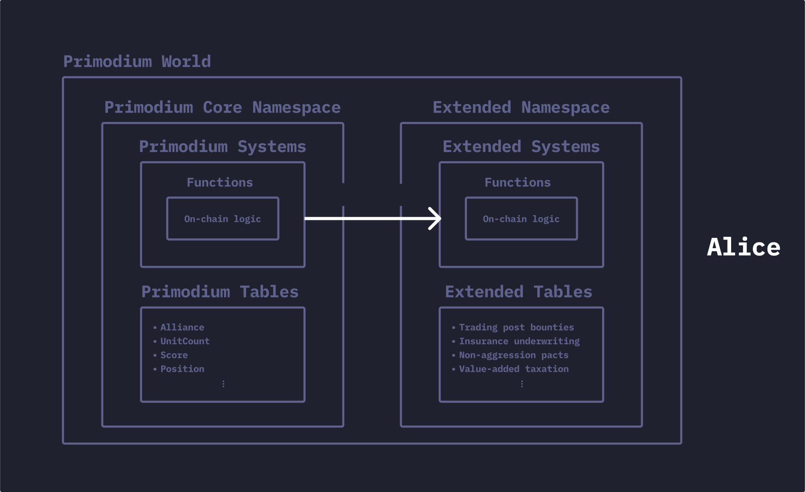
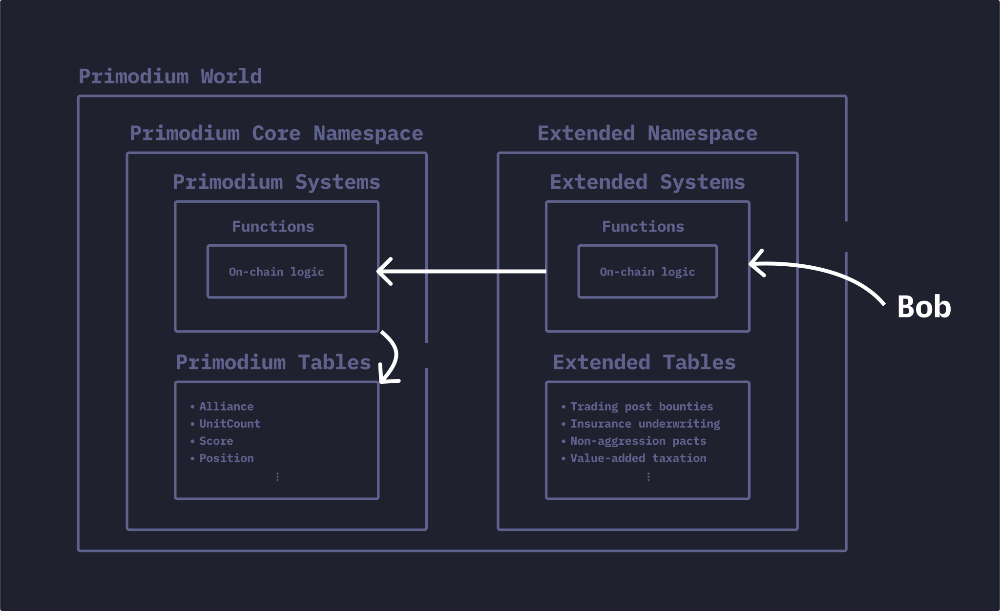

# Building Upgrade Bounty

Source code for the following example is available [here](https://github.com/primodiumxyz/developer/tree/main/examples/).

## Building Upgrade Bounty

**`BuildingUpgradeBounty`** is a world extension that enables the deployer to issue a private bounty for an outside party
to upgrade the deployer's building on their behalf, in exchange for a reward.

Building upgrades cost resources, and it takes time to accumulate the necessary resources.
There are some advantages of accelerating resource accumulation when you upgrade a building as soon as possible.

Let's look at two players, Alice and Bob. If Alice is going to be AFK and doesn't want to manage running a bot, she can create a building upgrade bounty and delegate the upgrade to another player, Bob, in exchange for a small reward.

- Alice deploys and registers namespace and private systems for extending game logic
- Alice delegates `UpgradeBuildingSystem` control to the private system
- Alice registers namespace access to Bob, Charlie, etc. to enable their participation in the bounty
- Alice deposits escrow (ETH) for the bounty in the private system
- Bob calls the private system to upgrade Alice's building
- Bob receives the bounty reward from the private system

## Diagrams

For the above example, the delegation flow begins with Alice delegating the `UpgradeBuildingSystem` control to the private system and then registering namespace access to Bob.

Then, Bob calls the private system to upgrade Alice's building through the external system in the external namespace.

