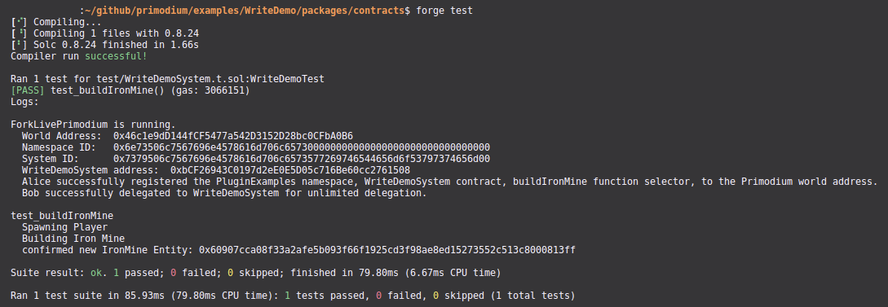

# Testing the World Extension

The commented code can be found in [`packages/contracts/test/WriteDemoSystem.t.sol`](https://github.com/primodiumxyz/developer/tree/main/examples/WriteDemo/packages/contracts/test/WriteDemoSystem.t.sol).

The test should execute by running `forge test` within the `packages/contracts/` folder. If you want to see additional details, you can run `forge test -vvvv` with 1-5 `v`s to increase verbosity. I generally recommend 4 or 5 for debug.

Not much changes from [ReadDemo](../readdemo/test-system.mdx) . We need an addition step in setUp() to delegate permission for the system to act on behalf of the user, but the rest is largely the same.

We will highlight the key differences in the Explanation below.

```solidity filename="examples/WriteDemo/packages/contracts/test/WriteDemoSystem.t.sol" showLineNumbers
// SPDX-License-Identifier: MIT
pragma solidity >=0.8.24;

import {MudTest} from "@latticexyz/world/test/MudTest.t.sol";
import {console2} from "forge-std/Test.sol";

import {WorldRegistrationSystem} from "@latticexyz/world/src/modules/init/implementations/WorldRegistrationSystem.sol";
import {System} from "@latticexyz/world/src/System.sol";

import {ResourceId} from "@latticexyz/store/src/ResourceId.sol";
import {WorldResourceIdLib} from "@latticexyz/world/src/WorldResourceId.sol";
import {RESOURCE_SYSTEM} from "@latticexyz/world/src/worldResourceTypes.sol";
import {StoreSwitch} from "@latticexyz/store/src/StoreSwitch.sol";
import {UNLIMITED_DELEGATION} from "@latticexyz/world/src/constants.sol";

import {WriteDemoSystem} from "../src/systems/WriteDemoSystem.sol";

import {IWorld} from "../src/codegen/world/IWorld.sol";
import {IWorld as IPrimodiumWorld} from "primodium/world/IWorld.sol";

import {Home, PositionData, Spawned} from "primodium/index.sol";

contract WriteDemoTest is MudTest {
    address extensionDeployerAddress = vm.envAddress("ADDRESS_ALICE");
    address playerAddressActive = vm.envAddress("ADDRESS_PLAYER_ACTIVE");
    address playerAddressInactive = vm.envAddress("ADDRESS_PLAYER_INACTIVE");

    address playerAddressBob = vm.envAddress("ADDRESS_BOB");
    uint256 playerPrivateKeyBob = vm.envUint("PRIVATE_KEY_BOB");

    bytes14 PRIMODIUM_NAMESPACE = bytes14("Primodium");
    bytes14 namespace = bytes14("PluginExamples");
    bytes16 system = bytes16("WriteDemoSystem");

    function setUp() public override {
        super.setUp();

        worldAddress = vm.envAddress("WORLD_ADDRESS");
        StoreSwitch.setStoreAddress(worldAddress);

        vm.createSelectFork(vm.envString("PRIMODIUM_RPC_URL"), vm.envUint("BLOCK_NUMBER"));
        console2.log("\nForkLivePrimodium is running.");

        WorldRegistrationSystem world = WorldRegistrationSystem(worldAddress);

        ResourceId namespaceResource = WorldResourceIdLib.encodeNamespace(bytes14(namespace));
        ResourceId systemResource = WorldResourceIdLib.encode(RESOURCE_SYSTEM, namespace, system);

        vm.startPrank(extensionDeployerAddress);

        world.registerNamespace(namespaceResource);

        WriteDemoSystem writeDemoSystem = new WriteDemoSystem();

        world.registerSystem(systemResource, writeDemoSystem, true);

        world.registerFunctionSelector(systemResource, "buildIronMine()");

        vm.stopPrank();

        vm.startBroadcast(playerPrivateKeyBob);

        world.registerDelegation(address(writeDemoSystem), UNLIMITED_DELEGATION, new bytes(0));

        vm.stopBroadcast();
    }

    function test_buildIronMine() public {
        console2.log("\ntest_buildIronMine");

        vm.startBroadcast(playerPrivateKeyBob);

        bytes32 playerEntity = bytes32(uint256(uint160(playerAddressBob)));
        bool playerIsSpawned = Spawned.get(playerEntity);
        if (!playerIsSpawned) {
            console2.log("Spawning Player");
            IPrimodiumWorld(worldAddress).Primodium__spawn();
        }

        console2.log("Building Iron Mine");
        bytes32 buildingEntity = IWorld(worldAddress).PluginExamples__buildIronMine();

        assert(uint256(buildingEntity) != 0);

        vm.stopBroadcast();
    }
```

<details>
<summary>Explanation</summary>

```ts
import { UNLIMITED_DELEGATION } from "@latticexyz/world/src/constants.sol";
```

This is a new import related to delegations. Aside from `UNLIMITED_DELEGATION`, there are also more restrictive options such as `CALLBOUND_DELEGATION`, `SYSTEMBOUND_DELEGATION`, and `TIMEBOUND_DELEGATION`.

```ts
world.registerDelegation(
  address(writeDemoSystem),
  UNLIMITED_DELEGATION,
  new bytes(0)
);
```

Here we execute the delegation. Note that we need to prank from a private key instead of an address, since this will normally cost gas.

</details>



<small>_Example Final Output_</small>
