# Primodium Game Guide

The game's victory conditions and colony ships are overhauled in v0.11. We also
added to our [contract plugin system guide](./world-extension.mdx) for players
to build different coordination mechanisms.

## Accounts

#### Connecting an external wallet

In v0.11, you can link your wallet with a saved session. Connecting to your
wallet lets you play across devices by saving progress to your wallet. We
currently support all of the wallets in the screenshot below.

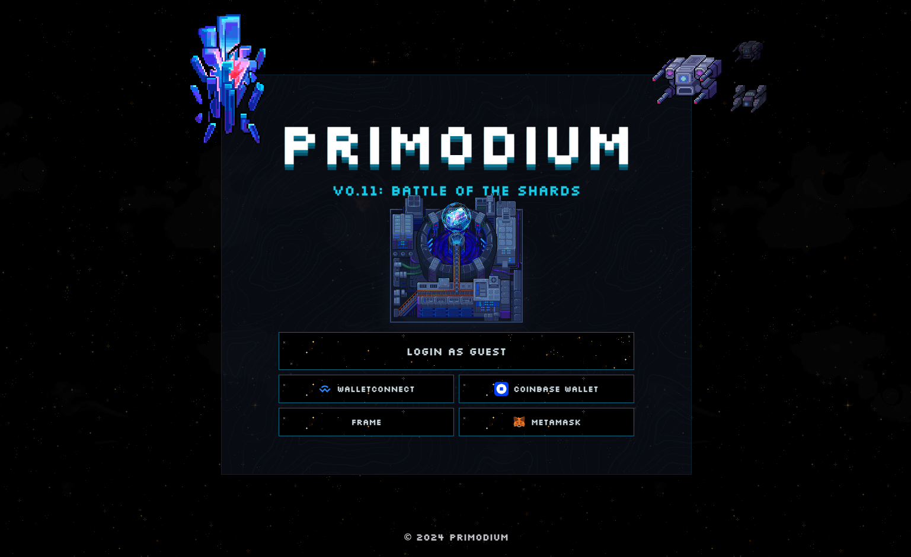
<small>_Intro screen for Primodium v0.11_</small>

When connected to a wallet, you'll be able to delegate actions to an in-browser
wallet, allowing you to play the game without signing repeatedly to confirm
every new action. This option should be automatically applied when you're
connected to your external wallet. If it isn't, you can reconnect it in the
**_Settings_** widget within the Account section:

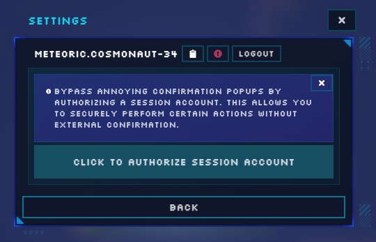

#### Playing without an external wallet

Alternatively, you can play as a guest if you don't want to use an external
wallet. We don't recommend doing this because you might lose your game progress
if your session is accidentally cleared.

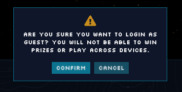
<small>_The warning message when you choose to play as a guest._</small>

## Command Center

In v0.11, you will be commanding fleets of units. A fleet is a collection of
units and can also carry cargo. With fleets, you can directly command a preset
group of units to attack other fleets in orbit, attack ground-based asteroids,
and ship resources to other asteroids.

To access your fleets on an asteroid, go to the **`Command Center`** (located on
the top of your screen).

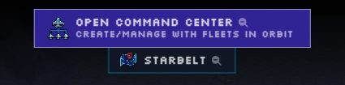

#### Creating and configuring your fleet

Before sending units out, you must create a fleet. As soon as you do, your units
in your fleet will start orbiting your asteroid. To create a fleet:

1. Click on your asteroid (the space rock with the home icon on it)

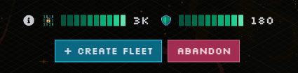

1. Left click on a unit from the asteroid side and place it in the fleet side by
   left clicking.

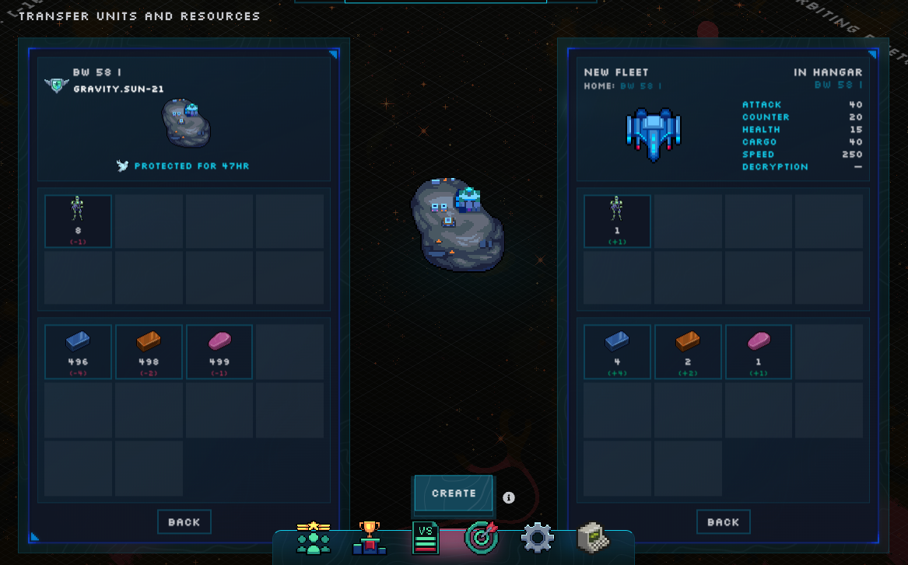

> 💡 Left clicking selects all units/resources. Right clicking selects just one
> unit/resource. While your mouse is holding a unit/resource, you can
> increase/decrease it by +/- 100 by typing W/A. To increase/decrease it by +/-
> 10, type D/A.

Resources held by your fleet cannot exceed the cargo stat shown. To increase
cargo limit, add more units.

The maximum number of fleets that you can have per asteroid is based on the
number of moves it has available. This is increased by building a starmapper
station and upgrading it.

When you're ready, click on `Create`, and your fleet will be created! After
that, you will see that your fleet will immediately be orbiting around your
asteroid. You can now send them out on missions.

## Commanding fleets

With fleets, you can:

- Move them to other asteroids
- Attack other fleets in orbit
- Attack other asteroids
- Transfer resources
- Defend or blockade an asteroid

#### Moving your fleet

In order to move your fleet, first go to the Starbelt and identify the location
of an asteroid that you would like to travel to.

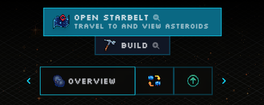

For this example, we will travel to a common asteroid shown at the top of the
following image.

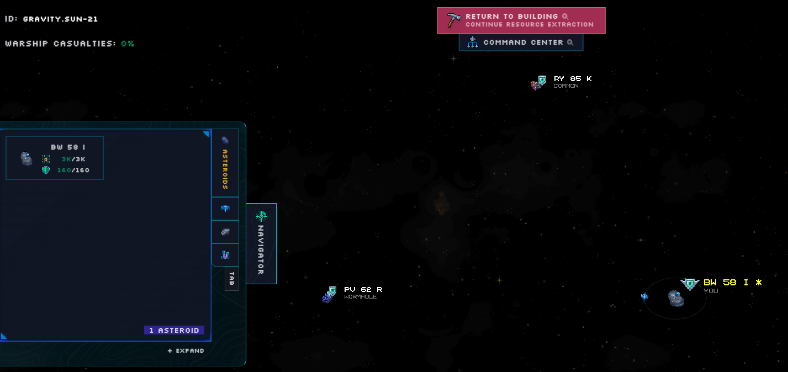

Click on the asteroid.

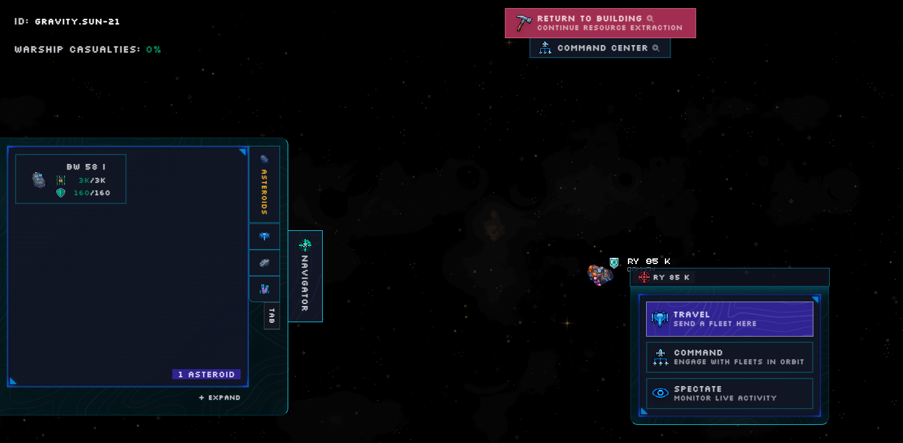

Click Travel.

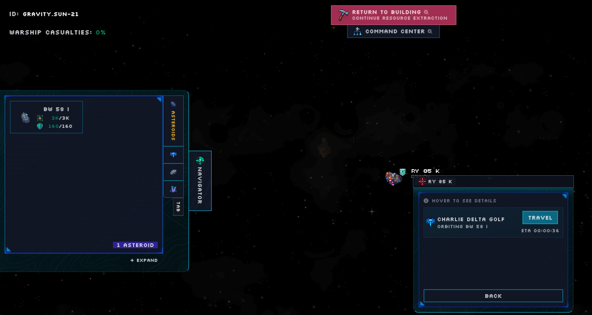

Identify the fleet that you want to move to this asteroid and click Travel. Your
fleet is now en route and will take some time to arrive.

#### Attack asteroid

Select the asteroid that you want to interact with, and select command.

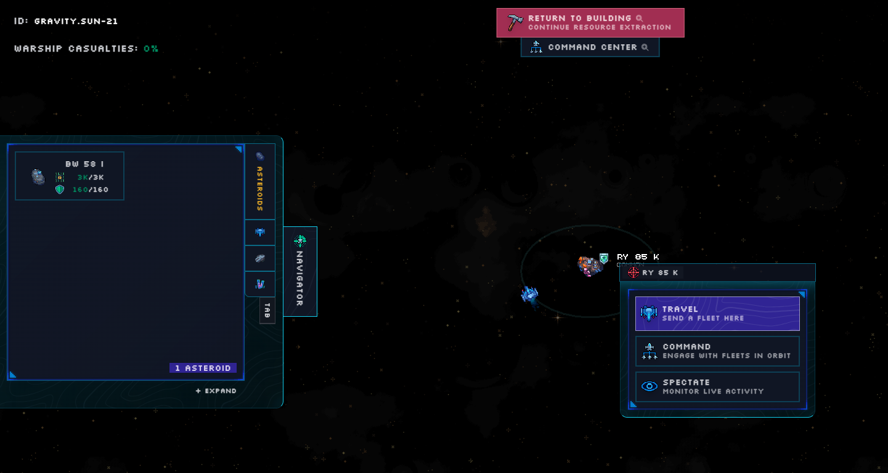

Select the asteroid or fleet that you would like to attack, and click "Attack".

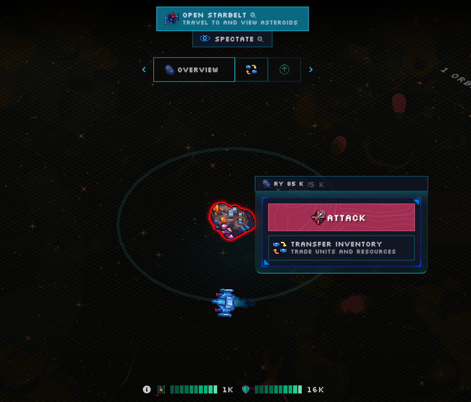

#### Other fleet options

For more options of how fleets can interact with other entities, you can select
your own fleet and choose any of the listed options.

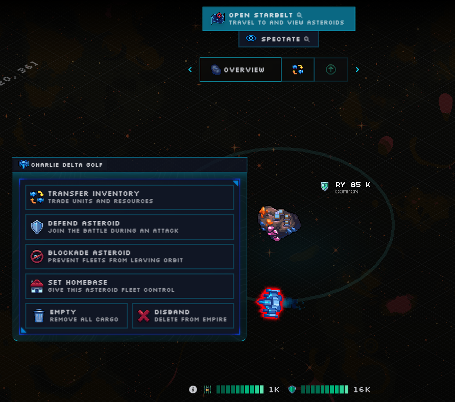

## Colonizing another asteroid

After your home asteroid has expanded significantly, you may want to conquer and
colonize to another asteroid to establish another base. Colonizing another
asteroid requires a significant amount of resources, so you should prepare
early.

Once you've colonized an asteroid, you can start building on it in a similar way
to how you've been developing your original base.

#### Encryption

Every asteroid has an `encryption` statistic. The encryption level of an
asteroid represents how secure it is from being conquered. Encryption is lowered
by a player successfully attacking an asteroid with a fleet that contains a
`colony ship`. Be aware that encryption is regenerated over time.

#### Shipyard

The `Shipyard` is a building where you can increase `colony slots` and train
`colony ships`. You cannot train a colony ship without a free colony slot.
Colony slots are occupied by an asteroid or by a colony ship. Once you pay for a
colony slot, it will persist regardless of whether it is occupied.

#### Lowering opponents' encryption

To lower your target's encryption, you need to attack your opponent with a
colony ship in your fleet. Each successful attack will lower your opponent's
encryption amount by 300. Once their encryption drops below 0, you will take
over the asteroid.

> 💡 While you are attacking an asteroid to lower their encryption, other
> players are also able to snipe asteroids with low encryption levels, so you
> should pay attention to the asteroids you're attacking.

Once you've successfully taken over an asteroid, your colony ship will be
destroyed. You will have to build another colony ship to colonize another
asteroid.

## Getting rare resources

#### Raiding

Raiding player asteroids. Player asteroids often have stashed resources that are
slowly being replenished. Beware, as there may be units and fleets guarding
these treasures. They may also have some unraidable resources in a Vault.

#### Mining

To get a permanent supply of rare resources, you can colonize one. This would
take significantly more effort, but will secure your supply.

#### Trading

You can also build a `Market` and trade for rare resources. However, the market
has some built-in fees and may fluctuate in price.

## Manage Widgets

You can manage widgets by clicking and dragging the top bar. Are the widgets too
big or covering too much of your screen? Don't worry we got you covered with the
UI scale option in the settings. Want to reset the widget? Just double-click the
widget's top bar.
