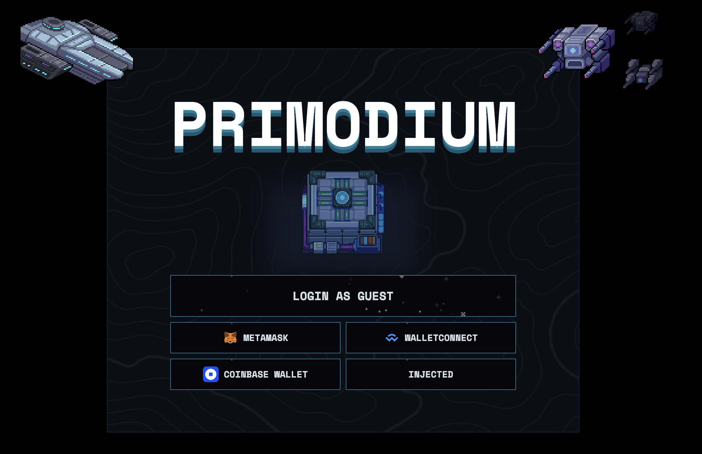
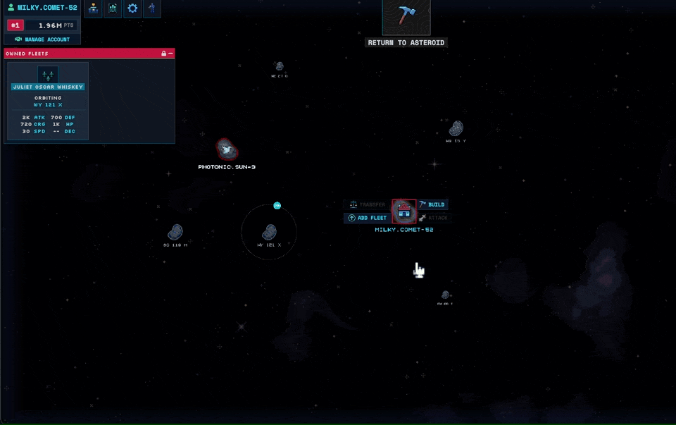

# Primodium Game Guide

The mechanisms for fleet creation, PvP, and mining are overhauled in v0.10. We also made a [plugin system](./world-extension.mdx) for players to build different coordination mechanisms.

## Accounts

#### Connecting an external wallet

In v0.10, you can now link your wallet with a saved session. Connecting to your wallet lets you play across devices by saving progress to your wallet. We currently support all of the wallets in the screenshot below.

The intro screen for Primodium v0.10

When connected to a wallet, you’ll be able to delegate actions to an in-browser wallet, allowing you to play the game without signing repeatedly to confirm every new action. This option should be automatically applied when you’re connected to your external wallet. If it isn’t, you can reconnect it in the **_manage account_** tab on the top left:

#### Playing without an external wallet

Alternatively, you can play as a guest if you don’t want to use an external wallet. We don’t recommend doing this because you might lose your game progress if your session is accidentally cleared.

The warning message when your choose to play as a guest.

## Fleets

In v0.10, instead of sending units individually towards other targets, you will be commanding fleets of units. A fleet is a collection of units and can also carry cargo. With fleets, you can directly command a preset group of units to attack other fleets in orbit, attack ground-based asteroids, and ship resources to other asteroids.

To access your fleets, go to the **`star map`** (located on the top of your screen).

#### Creating a fleet

Before sending units out, you must create a fleet. As soon as you do, your units in your fleet will start orbiting your asteroid. To create a fleet:

1. Click on your asteroid (the space rock with the home icon on it)
2. Click on the “Add fleet” button.

The add fleet menu will now show up. The maximum number of fleets that you can have per asteroid is based on the number of moves it has available. This is increased by building more starmapper stations.

#### Configuring your fleet

In the create fleet menu, you have the option to load units and resources onto the fleet. In the below example, there are 6 hammer drones and 4 trident marines available, as well as a variety of resources.

On the left, there are units and resources present on the asteroid they’re created from. On the right, there are slots for units and resources to be placed into a fleet. To add units and resources to a fleet, drag them from the left to the right. You can hold `shift` to transfer all units, and hold `ctrl` to control just half of them.

After you’ve done so, note that your new fleet has a maximum amount of cargo space (located under `CRG` in the fleet stats portion of the table. The resources will be stored with the fleet and will be transferred to wherever it goes.

When you’re ready, click on `Create fleet`, and your fleet will be created! After that, you will see that your fleet will immediately be orbiting around your asteroid. You can now send them out on missions.

#### Commanding fleets

With fleets, you can:

- Move them to other asteroids
- Attack other fleets in orbit
- Attack other asteroids
- Transfer resources
- Defend or blockade an asteroid

Each of these actions are done by clicking on the fleet and selecting it. For example, to move an asteroid, select the move button after selecting the fleet:

For more options, you can click on the `Manage` button. This will allow you to edit your fleet to unload resources, blockade asteroids, and more.

## Colonizing another asteroid

#### Other asteroids

When you’ve reached the maximum size of your asteroid, you may want to expand to another asteroid to establish another base. Colonizing another asteroid requires a significant amount of resources, so you should prepare early.

Once you’ve colonized an asteroid, you can start building on it in the same way you’ve been developing your original base.

Other asteroids on the map include:

- Pirate asteroids (uncolonizable)
- Platinum asteroids of various sizes (colonizable)
- Iridium asteroids of various sizes (colonizable)
- Kimberlite asteroids of various sizes (colonizable)
- Titanium asteroids of various sizes (colonizable)
- Other players’ asteroids (colonizable)

#### Encryption

Every asteroid starts out with an `encryption` of 100. The encryption level of an asteroid represents how secure it is. Encryption is lowered in lost asteroid battles but regenerates over time.

###### Training capital ships

To lower an opponent’s `encryption`, you need to first build a `capital ship`. Capital ships are trained in the `Shipyard` building.

###### Capital ship costs

Capital ships costs increases depending on how many existing capital ships and additional bases you have. For example, if you have 1 extra asteroid (2 total), then the next capital ship will cost 2x of the base price.

###### Lowering opponents’ encryption

To lower your target’s encryption, you need to attack your opponent with a capital ship in your fleet. Each successful attack will lower your opponent’s encryption amount by (x). Once their encryption drops below 0, you will take over the asteroid.

> 💡 While you are attacking an asteroid to lower their encryption, other players are also able to snipe asteroids with low encryption levels, so you should pay attention to the asteroids you’re attacking.

Once you’ve successfully taken over an asteroid, your capital ship will be destroyed. You will have to build another capital ship to colonize another asteroid.

## Getting rare resources

#### Method 1:

Raiding motherlode asteroids. These asteroids often have stashed resources that are slowly being replenished. Beware, as there may be droids guarding these treasures.

#### Method 2:

To get a permanent supply of motherlode resources, you can colonize one. This would take significantly more effort, but will secure your supply.
