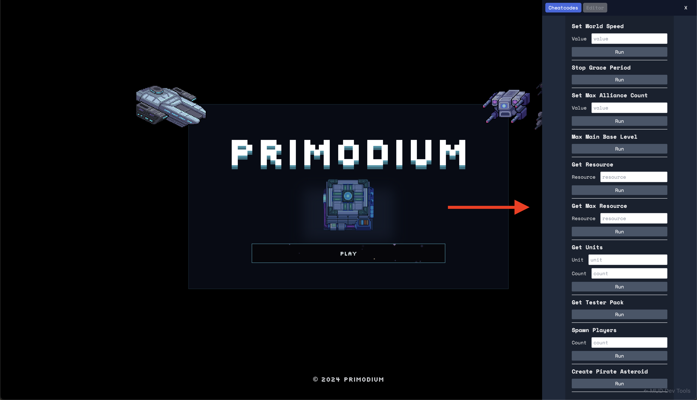
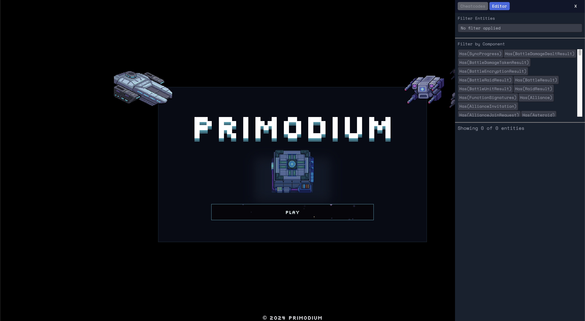

# Primodium Game Tools

**Primodium Game Tools** is a collection of tools for game developers to
interact with MUD-compliant smart contract state via a react component sidebar.
It supports custom cheat codes and a table editor.



## Installation

The package is available on the `npm` registry as `@primodiumxyz/mud-game-tools`
and can be installed with the following.

```bash copy
pnpm install @primodiumxyz/mud-game-tools
```

The source is released under the MIT License
[here](https://github.com/primodiumxyz/mud-game-tools). See its corresponding
[`README.md`](https://github.com/primodiumxyz/mud-game-tools/blob/main/README.md)
for more information.

### Browser

To integrate the development browser, add the following to your file:

```jsx showLineNumbers copy
import { Browser } from "mud-game-tools";
<Browser
  layers={{ react: { world, components: mud.components } }}
  world={world}
/>;
```

### CheatcodesList

To add the Cheatcodes list to the browser, create a Cheatcodes object with the
following interface:

```jsx showLineNumbers copy
export type Cheatcodes = Record<string, Cheatcode>;

// NOTE: the params field must match the names and types of function arguments
export type Cheatcode = {
  function: (...args: any[]) => any,
  params: { name: string, type: "number" | "string" | "boolean" }[],
};
```

To use it, add the cheatcodes as a parameter to the Browser:

```jsx showLineNumbers copy
import { Browser } from "mud-game-tools";
<Browser
  layers={{ react: { world, components: mud.components } }}
  world={world}
  cheatcodes={cheatcodes}
/>;
```

Access via the browser's `Cheatcodes` tab.


### Editor

Access via the browser's `Editor` tab. This allows you to:

- View game state
- Modify components
- Execute queries



## Development

Run the local development server:

```bash copy
pnpm run dev
```
