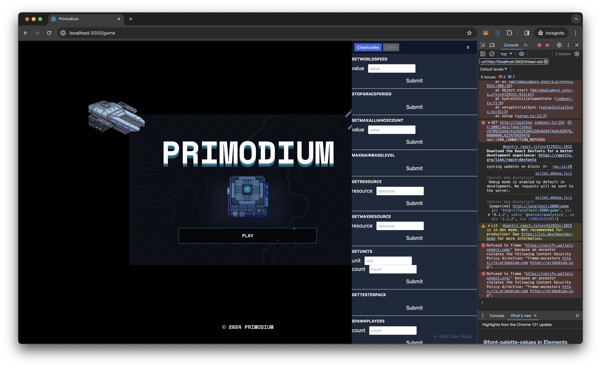

# MUD Game Tools

**MUD Game Tools** is a collection of tools for game developers to interact with MUD-complicant smart contract state via a react component sidebar. It supports custom cheat codes and a table editor.

TODO for Hank: Add better screenshot once CSS and editor are updated.



## Installation

The package is available on the `npm` registry as `@primodiumxyz/mud-game-tools` and can be installed with the following.

```bash
pnpm install @primodiumxyz/mud-game-tools
```

The source is released under the MIT License [here](https://github.com/primodiumxyz/mud-game-tools). See its corresponding [`README.md`](https://github.com/primodiumxyz/mud-game-tools/blob/main/README.md) for more information.
