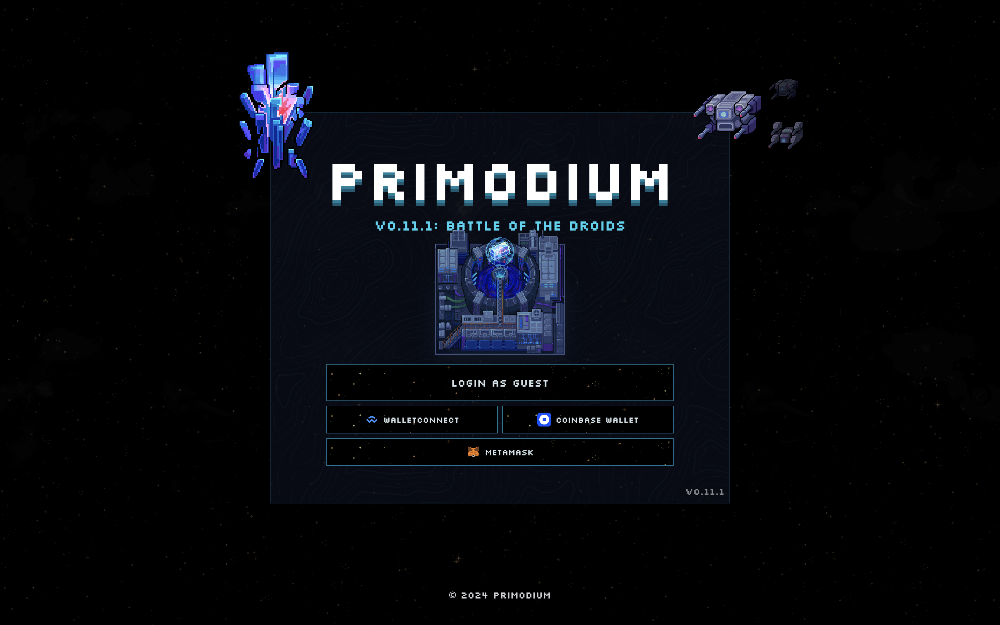

# Primodium Client

The **Primodium client** is our interface for interacting with the Primodium
contract suite.



## Introduction

The Primodium client is available in the
[`/packages/client`](https://github.com/primodiumxyz/primodium/tree/main/packages/client)
directory in the
[`@primodiumxyz/primodium`](https://github.com/primodiumxyz/primodium/)
monorepo.

This client imports all necessary packages from the rest of this monorepo to be
able to render the Phaser game, with a React UI on top of it, interact with the
contracts, and sync the state with the indexer database (or RPC updates).

## Running the game

Follow the [README](./overview-source/) in the root of th to install the
necessary dependencies and configure the environment.

```bash
pnpm dev
# or from root, provided that the backend is running
pnpm dev:client
```

Then navigate to [http://localhost:3000](http://localhost:3000) in your browser.

## Organization

This package uses
[the core package](https://github.com/primodiumxyz/primodium/tree/main/core) for
all the logic,
[the engine package](https://github.com/primodiumxyz/primodium/tree/main/engine)
for the Phaser scene management (api, creating scenes, rendering chunks),
[the game package](https://github.com/primodiumxyz/primodium/tree/main/game) for
Phaser, and
[the assets package](https://github.com/primodiumxyz/primodium/tree/main/assets)
for the assets.

It is dedicated to the various UI components, hooks, and utilities.

```ml
dist - "Compiled files for distribution"
src - "Source files"
├── __tests__ - "Client tests using vitest"
├── ampli - "Amplitude analytics setup"
├── components - "All of the UI components"
│   ├── core - "Main template components"
│   ├── hud - "Components related to the game HUD"
│   ├── shared - "Components shared across various screens"
│   └── transfer - "Components related to account"
├── config - "Core and Wagmi config"
├── contractCalls - "Calls to interact with the contracts"
├── hooks - "Various hooks"
├── screens - "React screens"
├── systems - "Game systems (session account)"
└── util - "Utility functions and cheatcodes"
```
