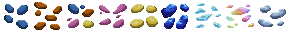
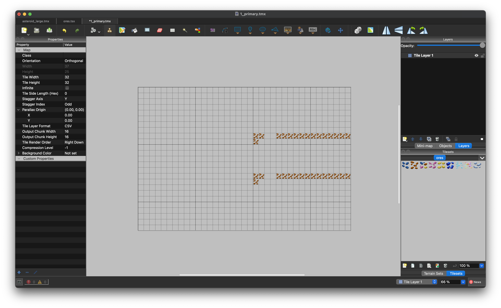
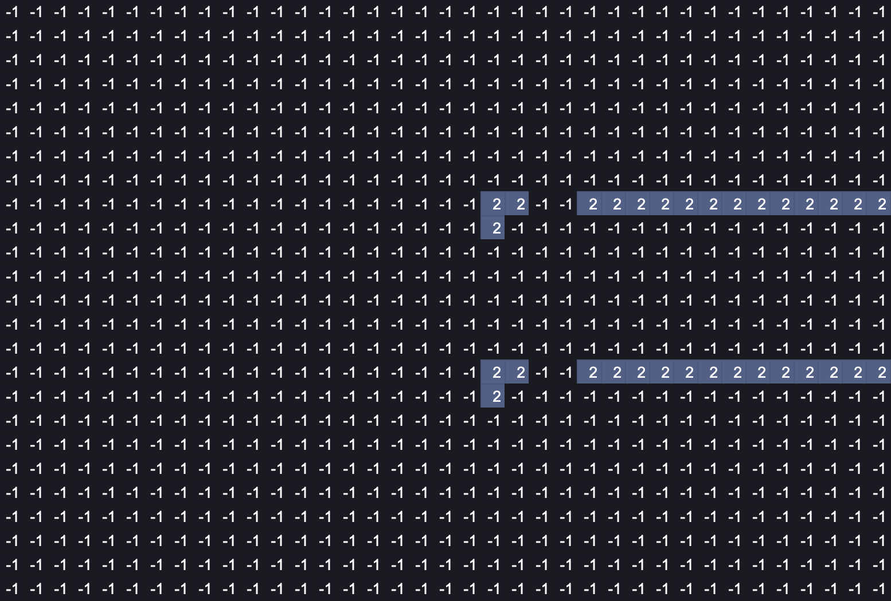

# Prototype Generation Example

**Prototype Generation** is Primodium's internal process for populating [prototype tables](./tables.mdx#prototype-tables) with game configuration data. During our game design and balancing processes, we needed to frequently change game data such as resource prices, building costs, and ore distribution.

Inspired by [Sky Strife's](https://github.com/latticexyz/skystrife-public) templates, we developed internal scripts to generate [Foundry scripts](https://book.getfoundry.sh/tutorials/solidity-scripting) from JSON objects and CSV files. This allows us to quickly iterate between playtests. This page describing an example workflow used internally for creating a new ore distribution map and writing to a terrain [prototype table](./tables.mdx#prototype-tables).

## Creating a Terrain Map

Primodium is played on a 2-dimensional map with manually-designed ore generation. The following sprite sheet displays ore tiles used in Primodium, with its corresponding IDs encoded below.



```tsx copy
const numberBase: Record<string, string> = {
  1: "Copper",
  2: "Iron",
  3: "Lithium",
  4: "Sulfur",
  5: "Titanium",
  6: "Kimberlite",
  7: "Iridium",
  8: "Platinum",
};
```

Using the open-source [Tiled](https://www.mapeditor.org/) map editor, we first create a `csv` file that contains the coordinates of the resources. The following is an ore distribution of Iron on a 37 x 25 space rock:



which is exported into the following .csv file, with commas as separators.



## Populating Tables

The following script creates a Solidity script from the CSV file that encodes the ore distribution. The script reads the CSV file and converts the ore distribution into a Foundry script that sets the ore distribution on the world contract.

```ts copy showLineNumbers
import { formatAndWriteSolidity } from "@latticexyz/common/codegen";
import fs from "fs";
import path from "path";

type terrainFile = { id: string; filePath: string };
type JsonCoords = {
  coord: { x: number; y: number };
  index: number;
  value: string;
};
export async function terraingen(
  csvSrcs: terrainFile[],
  outputBaseDirectory: string
) {
  const json = csvToJsonCoords(csvSrcs);
  const content = generateContent(json);
  const finalContent = addContext(content);
  const fullOutputPath = path.join(
    outputBaseDirectory,
    `scripts/CreateTerrain.sol`
  );
  await formatAndWriteSolidity(
    finalContent,
    fullOutputPath,
    `Generated terrain`
  );
}

const numberBase: Record<string, string> = {
  1: "Copper",
  2: "Iron",
  3: "Lithium",
  4: "Sulfur",
  5: "Titanium",
  6: "Kimberlite",
  7: "Iridium",
  8: "Platinum",
};

function csvToJsonCoords(csvUrls: terrainFile[]) {
  const result: Array<JsonCoords> = [];

  csvUrls.forEach((csvUrl) => {
    const csv = fs.readFileSync(csvUrl.filePath, "utf-8");
    const lines = csv.split("\n");
    for (let i = 0; i < lines.length; i++) {
      const currentLine = lines[i]
        .replace(/\s+/g, "")
        .split(",")
        .filter((x) => !!x);
      for (let j = 0; j < currentLine.length; j++) {
        if (currentLine[j] == "-1") continue;
        const value = numberBase[currentLine[j]];
        if (!value)
          throw new Error(
            `Invalid value ${currentLine[j]} at line ${i}, column ${j}`
          );
        result.push({
          coord: { x: j, y: i },
          index: Number(csvUrl.id),
          value: value,
        });
      }
    }
  });

  return result;
}

function generateContent(jsonContent: JsonCoords[]) {
  return jsonContent
    .map(
      (elem) =>
        `P_Terrain.set(${elem.index}, ${elem.coord.x}, ${elem.coord.y}, uint8(EResource.${elem.value}));`
    )
    .join("");
}

function addContext(str: string) {
  return `// SPDX-License-Identifier: MIT
pragma solidity >=0.8.21;

import { P_Terrain } from "codegen/index.sol";
import { EResource } from "codegen/common.sol";

  function createTerrain() {
    ${str}
}
`;
}
```

The generated Foundry script populates the `P_Terrain` table with the ore distribution, which is a [prototype table](./tables.mdx#prototype-tables). The following is the generated script for the Iron ore distribution:

```solidity copy showLineNumbers
// SPDX-License-Identifier: MIT
pragma solidity >=0.8.21;

import { P_Terrain } from "codegen/index.sol";
import { EResource } from "codegen/common.sol";

function createTerrain() {
  P_Terrain.set(1, 20, 8, uint8(EResource.Iron));
  P_Terrain.set(1, 21, 8, uint8(EResource.Iron));
  // continued with all other iron tiles
}
```

In the Primodium contract PostDeploy step as described in `PostDeploy.s.sol`, the `createTerrain` function is called to populate the `P_Terrain` table with the ore distribution.

```solidity copy {3} showLineNumbers
contract PostDeploy is Script {
  function run(address worldAddress) external {
    createTerrain();
    vm.stopBroadcast();
  }
}
```
