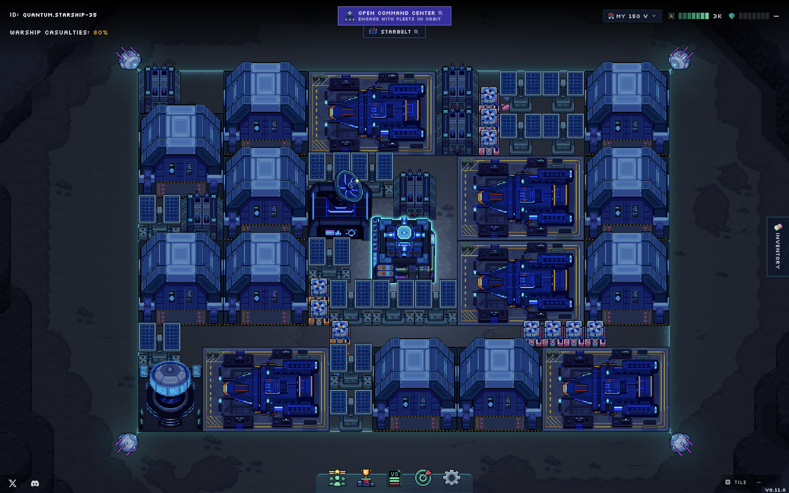

# Contributing



**Primodium** is a space-based, empire building MMO game. In Primodium, you mine
resources, build military bases, and fight others to gain control over the
asteroid belt.

Unlike most games on the market, Primodium is a fully on-chain game. This means
that all of Primodium's game logic and state are executed and stored on the
blockchain. The goal for Primodium is to be open and permissionless, meaning any
third party developer is free to build on top of it without constraints from
EULA or other agreements.

These developer documents are here to help you build on top of Primodium. You're
free to use them to build whatever you think would help give you a competitive
edge, enhance coordination between you and other players, or anything else you
can think of.

To get started as a Primodium developer, check out the
[source](./overview-source.mdx) and find ways to contribute below.

## Contract Extensions

Get started as a Primodium developer by cloning the example
[**ReadDemo**](./examples/readdemo.mdx) world extension.

```bash showLineNumbers copy
# Clone the Primodium Developer repository:
git clone https://github.com/primodiumxyz/developer.git

# Change your active directory:
cd developer/examples/ReadDemo/packages/contracts

# Install the necessary packages and build the project:
pnpm i && pnpm build

# Test the project:
forge test

# Do a dry-run of deployment:
forge script script/RegisterReadDemoSystem.s.sol --fork-url https://primodium-sepolia.rpc.caldera.xyz/http
```

**World extensions** refer to player smart contracts that extend the
functionality of Primodium's core contracts, which are documented in the
[world extensions guide](./world-extension.mdx).

## Game Design

You can contribute to Primodium's design and balancing by submitting pull
requests to
[`@primodiumxyz/primodium/config/prototypeConfig.ts`](https://github.com/primodiumxyz/primodium/blob/main/packages/contracts/config/prototypeConfig.ts),
which contains the main configuration for game prototypes in Primodium.

For example, the following code block from the above file defines the prototype
data for `IronPlateFactory`, a building that produces `IronPlates` from iron
mines. There are four fields that you can immediately modify to your own needs:

- `P_RequiredBaseLevel` denotes the base level required to construct or upgrade
  the building.
- `P_RequiredResources` denotes the resources required to construct or upgrade
  the building.
- `P_RequiredDependency` denotes the existing production rate required for the
  building to produce.
- `P_Production` specifies the production resources and denotes its production
  rate.

```ts filename="@primodiumxyz/primodium/config/prototypeConfig.ts#L510-L560" showLineNumbers {10-17}
{
  // ...
  IronPlateFactory: {
    tables: {
      P_Blueprint: { value: getBlueprint(2, 2) },
      P_MaxLevel: { value: 7n },
    },
    levels: {
      1: {
        // Requires Main Base Level 1 to construct.
        P_RequiredBaseLevel: { value: 1n },
        // `Copper` is required to construct or upgrade.
        P_RequiredResources: getResourceValues({ Copper: 200 }),
        // `IronPlateFactory` requires a minimum `Iron` production rate of `0.2` per second to produce `IronPlates`.
        P_RequiredDependency: getResourceValue({ Iron: 0.2 }),
        // `IronPlates` are produced at a rate of `0.08` per second.
        P_Production: getResourceValues({ IronPlate: 0.08 }),
      },
      // ...
    },
  }
  // ...
}
```

See
[`@primodiumxyz/primodium/config/enums.ts`](https://github.com/primodiumxyz/primodium/blob/main/packages/contracts/config/enums.ts#L39-L66)
for the resource types available in Primodium. The following
[prototype config](./overview-source/configuration.mdx) in TypeScript is
[generated](./overview-source/generation.mdx) into Solidity on compilation.

```ts filename="@primodiumxyz/primodium/config/enums.ts#L39-L66" showLineNumbers
export enum EResource {
  Iron = 1,
  Copper,
  Lithium,

  Titanium,
  Iridium,
  Kimberlite,
  Platinum,

  IronPlate,
  Alloy,
  PVCell,
  RocketFuel,
  // ...
}
```

## Source

See the Primodium [source guide](./overview-source.mdx) for details on how to
reference Primodium's source in your world extensions.
