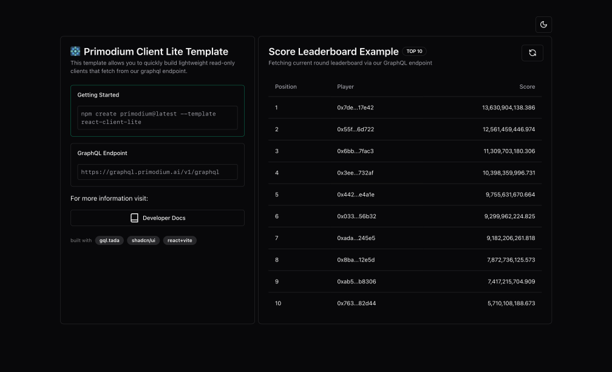

# React Client Lite

This template provides a minimal setup to start working on a read-only client
for Primodium via our [GraphQL Endpoint](./creating-dashboards.mdx). Visit the
demo site [here](https://template-react-client-lite.vercel.app/).




## Getting started

```bash copy
npm create primodium@latest --template react-client-lite
cd react-client-lite
npm install
npm run dev
```

The Primodium `react-client-lite` template is based on `react+vite`. It uses
[`gql.tada`](https://gql-tada.0no.co/) for query authoring and `shadcn/ui` for
UI elements. Source for the template is available on Github
[here](https://github.com/primodiumxyz/create-primodium/tree/main/template-react-client-lite).

To get `gql.tada` magic introspection working, make sure that your editor is
using the workspace typescript version or this will not work. For Visual Studio
Code, you will be prompted to switch versions.

## Production ESLint Config

If you are developing a production application, we recommend updating the
default `eslintrc.cjs` config to enable type aware lint rules:

- Add the following `parserOptions` property to the the top-level configuration:

```js filename=".eslintrc.cjs" showLineNumbers {3-8} copy
module.exports = {
  // ...other rules
  parserOptions: {
    ecmaVersion: "latest",
    sourceType: "module",
    project: ["./tsconfig.json", "./tsconfig.node.json"],
    tsconfigRootDir: __dirname,
  },
};
```

- Replace `plugin:@typescript-eslint/recommended` with
  `plugin:@typescript-eslint/recommended-type-checked` or
  `plugin:@typescript-eslint/strict-type-checked`.
- Optionally, add `plugin:@typescript-eslint/stylistic-type-checked`.
- Install
  [eslint-plugin-react](https://github.com/jsx-eslint/eslint-plugin-react) and
  add `plugin:react/recommended` & `plugin:react/jsx-runtime` to the `extends`
  list.

The final `.eslintrc.cjs` will look like this:

```js filename=".eslintrc.cjs" showLineNumbers {6-7,9-10,16-22} copy
module.exports = {
  root: true,
  env: { browser: true, es2020: true },
  extends: [
    "eslint:recommended",
    "plugin:@typescript-eslint/recommended-type-checked", // or plugin:@typescript-eslint/strict-type-checked
    "plugin:@typescript-eslint/stylistic-type-checked", // optional
    "plugin:react-hooks/recommended",
    "plugin:react/recommended",
    "plugin:react/jsx-runtime",
  ],
  ignorePatterns: ["dist", ".eslintrc.cjs"],
  parser: "@typescript-eslint/parser",
  plugins: ["react-refresh"],

  // Add parserOptions
  parserOptions: {
    ecmaVersion: "latest",
    sourceType: "module",
    project: ["./tsconfig.json", "./tsconfig.node.json"],
    tsconfigRootDir: __dirname,
  },
};
```
