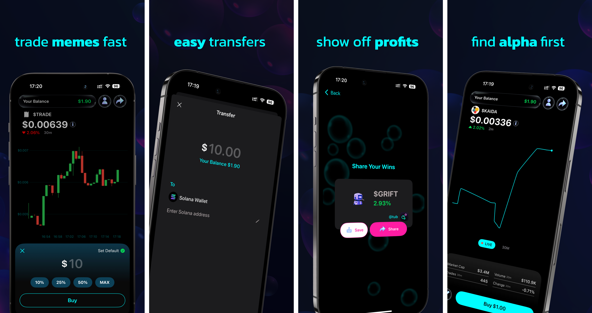

# Tub



**Tub** is a mobile trading app for memecoins on Solana with a full backend
stack.

## Introduction

The source code for this repository is available on Github
[here](https://github.com/primodiumxyz/tub-ios). This monorepo is composed of an
`ios` package for the Swift iOS app, and a few components for the backend stack
that are modified versions of published libraries.

Refer to their dedicated pages for documentation on the
[Solana DEX Server](./dex-server.mdx) and the
[Solana DEX GraphQL](./dex-graphql.mdx) packages.

### Overview

The [iOS app](https://github.com/primodiumxyz/tub-ios/blob/main/apps/ios/) is a
SwiftUI app that allows users to trade memecoins indexed by our
[indexer](https://github.com/primodiumxyz/dex-indexer-stack/tree/main/packages/indexer)
in the
[database](https://github.com/primodiumxyz/tub-ios/blob/main/packages/gql/).

They can onramp to an embedded Solana wallet with [Privy](https://www.privy.io/)
using the
[Coinbase onramp SDK](https://help.coinbase.com/en/developer-platform/coinbase-onramp-sdk).

Trades are constructed and submitted using our
[server](https://github.com/primodiumxyz/tub-ios/blob/main/apps/server/), which
handles priority fees that are sponsored by a provided wallet.

The codebase is structured as a `pnpm` monorepo with the following packages:

```ml
apps - "Applications that compose the entire stack"
├── dashboard - "A React dashboard for visualizing top-ranked tokens and analytics data from the app"
├── ios - "The Swift iOS app"
└── server - "A modified version of the published `@primodiumxyz/dex-server` package"
packages - "Libraries that compose the stack"
└── gql - "A modified version of the published `@primodiumxyz/dex-graphql` package"
```

### Installation

This monorepo uses `pnpm` as its package manager. First,
[install `node`, then `npm`](https://docs.npmjs.com/downloading-and-installing-node-js-and-npm),
then install `pnpm`.

```bash
npm install -g pnpm
```

This repository is tested with `node` version `23.5.0` and `pnpm` version
`9.15.2`.

Then, clone the repository and install the necessary npm packages with the
following from the root folder:

```bash
git clone https://github.com/primodiumxyz/tub-ios.git
cd tub-ios
pnpm i
```

See each respective package's README for more information on installation and
requirements.

### Environment

To set the current environment variables for both local development and
production, copy `/.env.example` to a new `/.env`.

```bash
cp .env.example .env
```

See
[the example environment file](https://github.com/primodiumxyz/tub-ios/blob/main/.env.example)
for information on each variable.

You will need to the the server and database instance URLs in the
[`Constants.swift`](https://github.com/primodiumxyz/tub-ios/blob/main/apps/ios/Tub/Sources/Utils/Constants.swift)
file for the built app to work.

Same is true for the Privy app ID and client ID in the
[`Privy.swift`](https://github.com/primodiumxyz/tub-ios/blob/main/apps/ios/Tub/Sources/Privy.swift)
file.

### Dependencies

This stack—or specifically the indexer—requires some external services to
request and subscribe to onchain data.

- [Yellowstone GRPC](https://github.com/rpcpool/yellowstone-grpc) for streaming
  transactions with low latency
- [Jupiter](https://station.jup.ag/docs/apis/price-api-v2) for fetching token
  prices (`/prices`)
- [DAS API](https://developers.metaplex.com/das-api) for fetching token metadata
  in the Metaplex standard (`/getAssets`)

All of these are available from QuickNode through add-ons, which is the
recommended way to run the indexer.

Otherwise, Hasura and Timescale will be run locally during development, and can
be either self-hosted or cloud-hosted with their respective offerings.

## Development

First, install
[Docker Desktop](https://www.docker.com/products/docker-desktop/), or any other
preferred Docker alternative. [OrbStack](https://orbstack.dev/) is a good and
efficient alternative for Mac users. This will be required to run the database.

Running the following in the root directory of this monorepo will spin up both
the indexer and databases/interfaces, as well as the dashboard for analytics.

```bash
pnpm dev
```

You can run the dashboard only to monitor remote analytics; first set
`NODE_ENV=production` in the `.env` file, then run the following:

```bash
pnpm dev:dashboard
```

If you would like to test the app on a physical device and point to the local
instances, you will need to set up a tool such as [ngrok](https://ngrok.com/) to
tunnel the local development URLs to a public endpoint. This would be done for
both the local server and database instances. And then, update the
[`Constants.swift`](https://github.com/primodiumxyz/tub-ios/blob/main/apps/ios/Tub/Sources/Utils/Constants.swift)
file to read the ngrok environment variables. Note that this might be tricky to
configure for the GraphQL URLs.

Refer to the README in [`/apps/ios`](/apps/ios/README.md) to test the latest
user-facing features, such as launching the app in Xcode.

## Contributing

If you wish to contribute to the package, please open an issue first to make
sure that this is within the scope of the repository, and that it is not already
being worked on.

## License

This project is licensed under the MIT License - see
[LICENSE](https://github.com/primodiumxyz/tub-ios/blob/main/LICENSE) for
details.
