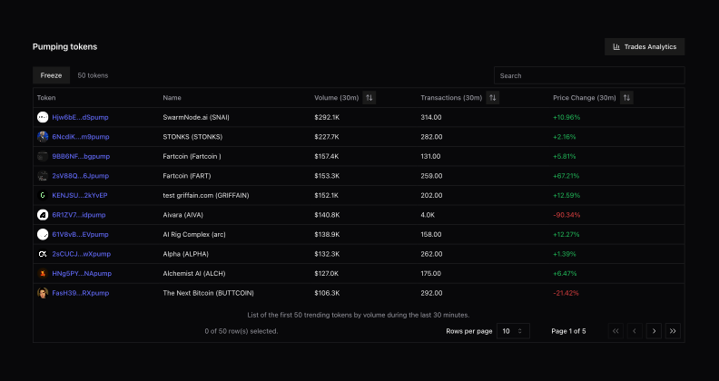

# Solana DEX dashboard



A React dashboard for visualizing the data indexed in the
[`GraphQL`](https://github.com/primodiumxyz/tub-ios/blob/main/packages/gql/README.md)
database. It uses [shadcn/ui](https://ui.shadcn.com/) for styling and
[TradingView](https://www.tradingview.com/) for the line and candles charts.

The purpose of this dashboard is to visualize conveniently top-ranked tokens
that will show up in the iOS app, with their line & candles charts, as well as
user analytics to understand the user behavior.

The source code this repository is available on Github
[here](https://github.com/primodiumxyz/tub-ios/blob/main/apps/dashboard/).

## Installation

1. Install dependencies:

   ```sh
   pnpm i
   ```

2. Configure the environment variables in the root `.env` file (or don't, and
   use the defaults):

| Variable          | Description                     | Default                 |
| ----------------- | ------------------------------- | ----------------------- |
| `NODE_ENV`        | Environment (local, production) | `local`                 |
| `VITE_HASURA_URL` | URL of the Hasura endpoint      | `http://localhost:8090` |

## Usage

To run the dashboard:

```sh
pnpm dev # from dashboard
pnpm dev:dashboard # from root
```

The dashboard will be available at
[http://localhost:5173](http://localhost:5173).

## Contributing

If you wish to contribute to the package, or add an example, please open an
issue first to make sure that this is within the scope of the repository.

## License

This project is licensed under the MIT License - see
[LICENSE](https://github.com/primodiumxyz/tub-ios/blob/main/LICENSE) for
details.
