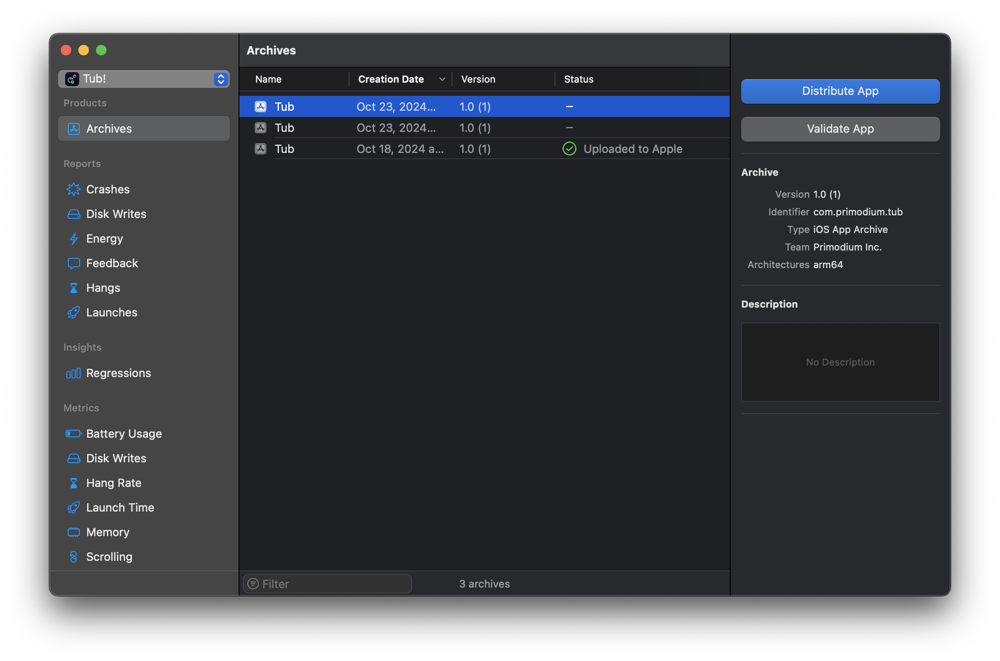
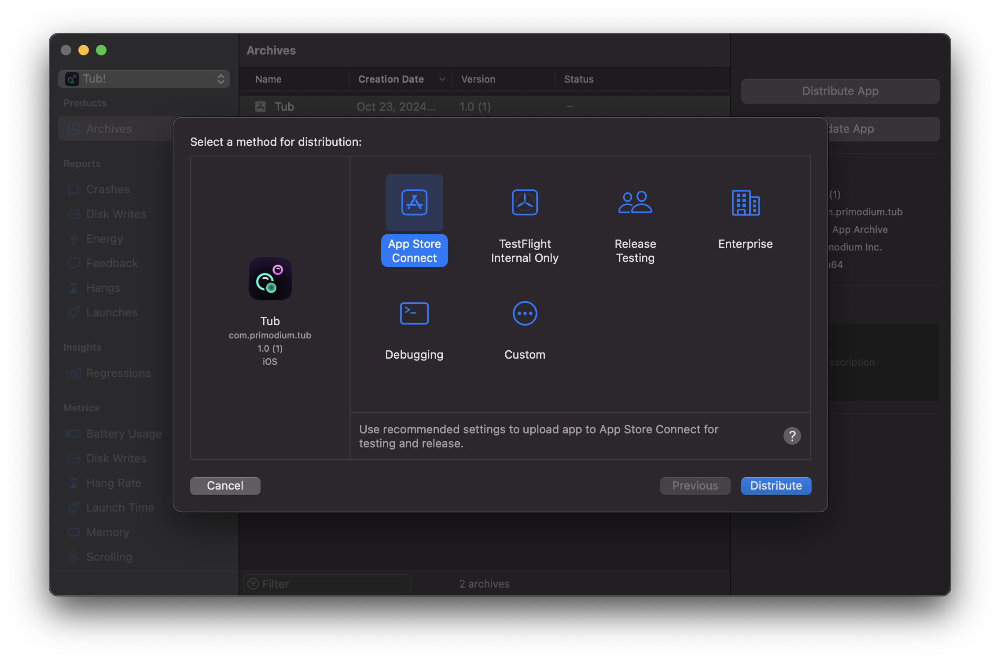

# Tub iOS Client

**Tub** is an iOS app for trading memecoins on Solana. The source code this
repository is available on Github
[here](https://github.com/primodiumxyz/tub-ios/tree/main/apps/ios).

## Introduction

This package contains the Tub iOS client, written in Swift and managed as an
Xcode project. To get started, open this directory in Xcode 16 or above.

### Overview

The Tub iOS app is a mobile trading platform for memecoins on Solana. It allows
users to onramp to an wallet embedded in the app, buy and sell top-ranked
memecoins in a simple swipe-to-trade interface.

### Installation

Refer to the [main documentation page](../tub.mdx#development) for installing
prequisites.

## Development

Run the entire stack locally from root with:

```bash
pnpm dev
```

Open the `/apps/ios` directory in Xcode with `File > Open`. The main Xcode
project file is `Tub.xcodeproj`.

Then, run the application with `Product > Run`. If you don't have a set
destination for the iOS app, set a build destination with
`Product > Destination` to either a tethered iOS device or an iOS simulator.

### GraphQL

The GraphQL types and schema are managed separately from the co-located
TypeScript `@tub/gql` package in this repository. Instead, the iOS app uses
Swift types generated with
[`apollo-ios`](https://github.com/apollographql/apollo-ios)

#### Setup

When the GraphQL schema is modified, the GraphQL schema will have to be
re-fetched. First, check that the `endpointURL` field in
`./apollo-codegen-config.json` is valid. If the referenced URL references
`localhost`, launch the developer Hasura instance first from the `@tub/gql`
package in `packages/gql`.

```json
{
  ...
  "schemaDownloadConfiguration": {
    "downloadMethod": {
      "introspection": {
        "endpointURL": "http://localhost:8080/v1/graphql",
        "httpMethod": {
          "POST": {}
        },
        "includeDeprecatedInputValues": false,
        "outputFormat": "SDL"
      }
    },
    "downloadTimeout": 60,
    "headers": [],
    "outputPath": "./graphql/schema.graphqls"
  }
  ...
}
```

#### Fetching schema

Then, to fetch schema from the GraphQL server, run the following:

```
./apollo-ios-cli fetch-schema
```

This fetches the GraphQL schema to `./graphql/schema.graphqls`.

Then, write a new query in the gql package at
[`./src/graphql/queries.graphql`](https://github.com/primodiumxyz/tub-ios/tree/main/packages/gql/src/graphql/queries.ts).
Or same for mutations and subscriptions. This will allow you to benefit from
type-safety.

```typescript
export const GetWalletTokenPnlQuery = graphql(`
  query GetWalletTokenPnl($wallet: String!, $token_mint: String!) {
    transactions_value_aggregate(
      where: { user_wallet: { _eq: $wallet }, token_mint: { _eq: $token_mint } }
    ) {
      total_value_usd
    }
  }
`);
```

Then sync the gql package to generate the GraphQL types in the iOS app with:

```bash
pnpm sync:gql:ios # from root
```

#### Generating types

Generate GraphQL Swift types with the following:

```
./apollo-ios-cli generate
```

See `Tub/Models` for examples of GraphQL query and subscription fetching.

### Colors

In arguments that expect a color, the `Color` object can be omitted when
referring to a default system color. For example, `Color.red` can be used in
`.foregroundStyle()` as `.foregroundStyle(.red)`.

All colors in this app is listed in `/apps/ios/Tub/Assets.xcasset`. Of all the
customizable colors, only `AccentColor` is referred using the dot color
shorthand of `.accent`.

For text, always use `.primary` and `.secondary` as colors, which match up with
the system color scheme. For elements such as buttons, use `.tubPrimary` and
`.tubSecondary` instead.

All other colors are referred as `.tubColorName`. For example, to refer to the
`tubError` color, use `.tubError`.

## Distribution

First, create an archive in Xcode with `Product > Archive`. The following window
will pop up.



Select a build and click on `Distribute App`.



For _App Store_ or _External Testflight_, select `App Store Connect`. For
_TestFlight Internal Testing_, select `TestFlight Internal Only`. Click on
`Distribute` to upload the build to App Store Connect.

## Contributing

If you wish to contribute to the package, please open an issue first to make
sure that this is within the scope of the repository, and that it is not already
being worked on.

## License

This project is licensed under the MIT License - see
[LICENSE](https://github.com/primodiumxyz/tub-ios/tree/main/LICENSE) for
details.
