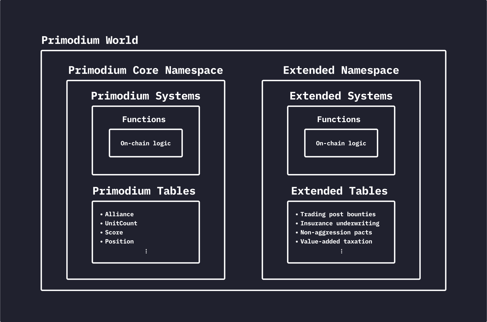

# Primodium World Extensions

World Extension is a concept [introduced by MUDv2](https://mud.dev/guides/extending-a-world) to allow third parties
to extend the world with new commands, logic, and data while still
being subject to the same rules and restrictions (aka onchain physics)
as the core game.

If this is a confusing concept, you can think of World Extension
as "Contract Plugins" to the Primodium world.

